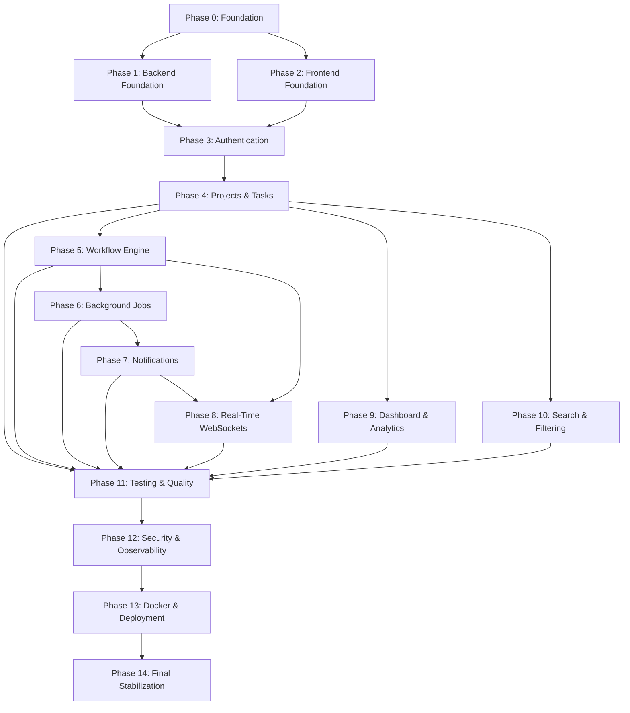
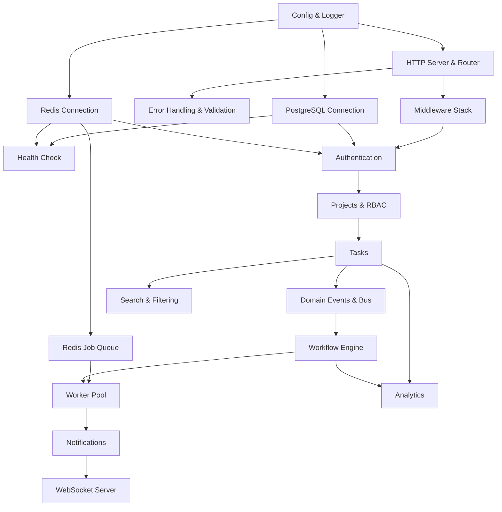
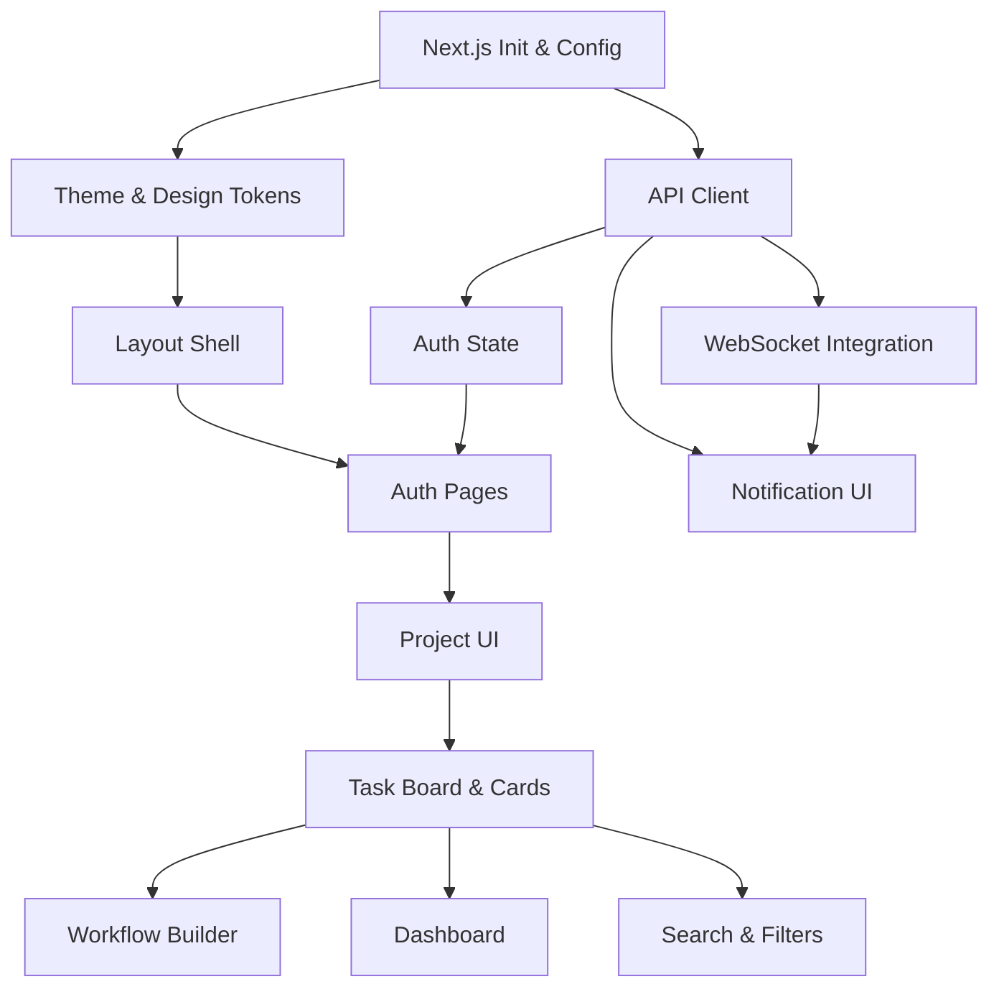

# GoFlow: Work Plan

**Version:** 1.0.0
**Status:** Active Execution Plan
**Source of Truth:** [`requirements.md`](file:///E:/ME/goflow/requirements.md)
**Design Reference:** [`design.md`](file:///E:/ME/goflow/design.md)
**Last Updated:** 2026-08-12

---

## Current Project Progress

```text
Project: GoFlow

Overall Progress: 47%

Completed Phases: 11 / 15

Current Phase: Phase 11 — Testing & Quality

Backend Progress:  100%
Frontend Progress: 100%

Current Status: Complete
```

---

## Current Phase

```text
Current Phase: Phase 7 — Notifications

Backend Progress:  75%
Frontend Progress: 0%

Current Status: In Progress

Blocked Tasks:
None
```

---

## 1. Project Overview

**GoFlow** is an intelligent task management and workflow automation platform designed to help individuals and teams manage projects, tasks, workflows, notifications, and automated background actions seamlessly.

It bridges the gap between simple task managers and heavy enterprise workflow engines by combining an intuitive task management UI with a lightweight, responsive background automation engine.

### Core Technology Stack

| Layer | Technology |
|---|---|
| Backend API & Engine | Go (Golang) |
| Frontend | Next.js 14+ (App Router), TypeScript, Tailwind CSS |
| Primary Database | PostgreSQL |
| Cache & Queue | Redis |
| API Protocol | REST (JSON) with `/api/v1` versioning |
| Real-Time | WebSockets (native Go hub) |
| Background Processing | Go worker pools (Goroutines, Channels, Redis queue) |
| Containerization | Docker & Docker Compose |

### Key Capabilities

- **Projects & Tasks:** Kanban boards, subtasks, tags, comments, assignment, priorities, due dates
- **Workflow Automation:** `WHEN → CONDITION → ACTION` rule engine with async execution
- **Background Workers:** Redis-backed job queue with retry, dead-letter, and graceful shutdown
- **Notifications:** In-app (persisted), email (async), and real-time WebSocket push
- **Dashboard & Analytics:** Task statistics, project progress, workflow metrics, productivity trends
- **Search & Filtering:** Full-text search, multi-field filtering, sorting, pagination
- **Authentication:** JWT access/refresh tokens, session management, password reset, account lockout

### V1 Non-Goals (Out of Scope)

- Enterprise BPMN / visual flowchart canvas
- SAML / Okta SSO (JWT + OAuth2 only)
- Third-party plugin SDKs (Slack, Jira deferred to V2)
- Distributed microservices mesh (modular monolith)

---

## 2. Development Strategy

GoFlow is developed in **15 clearly separated phases**, each building on the previous one. Dependencies are strictly respected — no phase begins until its prerequisites are complete.

```text
Phase 0  — Project Foundation
Phase 1  — Backend Foundation
Phase 2  — Frontend Foundation
Phase 3  — Authentication
Phase 4  — Projects & Tasks
Phase 5  — Workflow Engine
Phase 6  — Background Jobs & Workers
Phase 7  — Notifications
Phase 8  — Real-Time Features (WebSockets)
Phase 9  — Dashboard & Analytics
Phase 10 — Search & Filtering
Phase 11 — Testing & Quality
Phase 12 — Security & Observability
Phase 13 — Docker & Deployment
Phase 14 — Final Stabilization
```

### Strategy Principles

1. **Dependency-First:** Every phase lists explicit prerequisites. No feature work begins before its foundation is verified.
2. **Backend-Before-Frontend:** For each feature domain, backend API endpoints are completed and manually testable before the corresponding frontend UI is built.
3. **Incremental Integration:** Backend and frontend are developed as separate concerns with a clear integration boundary at the REST API. Integration milestones validate end-to-end flow at each major feature boundary.
4. **Living Document:** This work plan is updated after every completed task. Progress tables reflect actual codebase state.

---

## 3. Backend & Frontend Separation

Backend and frontend are developed as **independent concerns** sharing only the REST API contract and WebSocket event protocol as their integration boundary.

### Project Structure

```text
GoFlow/
│
├── backend/                    # Go backend (API server + worker)
│   ├── cmd/
│   │   ├── server/             # API server entrypoint
│   │   └── worker/             # Background worker entrypoint
│   ├── internal/
│   │   ├── config/             # Environment & configuration
│   │   ├── domain/             # Entities, interfaces, constants, errors
│   │   ├── handler/            # HTTP & WebSocket handlers
│   │   ├── service/            # Business logic layer
│   │   ├── repository/         # Database access layer
│   │   └── worker/             # Job definitions & consumers
│   ├── pkg/                    # Reusable utilities (logger, crypto, validator)
│   ├── migrations/             # PostgreSQL migration files
│   ├── go.mod
│   └── go.sum
│
├── frontend/                   # Next.js frontend
│   ├── src/
│   │   ├── app/                # App Router pages & layouts
│   │   ├── components/         # Reusable UI components
│   │   ├── lib/                # API client, utilities, hooks
│   │   └── styles/             # Global CSS, theme tokens
│   ├── package.json
│   └── tsconfig.json
│
├── docs/                       # Project documentation
│   ├── requirements.md
│   ├── design.md
│   └── work-plan.md
│
├── docker-compose.yml          # Local dev environment
├── .env.example                # Environment variable template
├── .gitignore
└── README.md
```

### Backend

| Concern | Technology |
|---|---|
| Language | Go 1.22+ |
| HTTP Router | Chi / Gin / Fiber |
| Database | PostgreSQL 16 via pgx / sqlc |
| Cache & Queue | Redis 7 |
| Authentication | JWT (access + refresh), bcrypt/Argon2id |
| WebSockets | gorilla/websocket or nhooyr.io/websocket |
| Background Jobs | Redis-backed queue (asynq or custom stream consumer) |
| Testing | `testing` + `testify` + `testcontainers-go` |

### Frontend

| Concern | Technology |
|---|---|
| Framework | Next.js 14+ (App Router) |
| Language | TypeScript |
| Styling | Tailwind CSS + Cherry Red Dark Theme |
| UI Primitives | Shadcn UI / Radix Primitives, Lucide Icons |
| State | TanStack Query (server) + Zustand (client UI) |
| Forms | React Hook Form + Zod |
| WebSocket | Custom `useWebSocket` hook |

---

## 4. Work Breakdown Structure

### Task ID Prefixes

```text
INFRA = Infrastructure & DevOps
BE    = Backend
FE    = Frontend
DB    = Database
QA    = Testing & Quality Assurance
SEC   = Security
DOC   = Documentation
OPS   = Operations & Deployment
```

### Priority Levels

```text
P0 = Critical — Blocks everything downstream
P1 = High    — Required for phase completion
P2 = Medium  — Important but not blocking
P3 = Low     — Nice to have for V1
```

---

## 5. Phase 0 — Project Foundation

**Goal:** Establish repository structure, development environment, and infrastructure containers.
**Prerequisites:** None
**Deliverable:** A developer can clone the repo, run `docker-compose up`, and have PostgreSQL + Redis accessible.

| ID | Phase | Area | Task | Description | Dependency | Priority | Status | Progress |
|---|---|---|---|---|---|---|---|---|
| INFRA-001 | P0 | Repo | Initialize Git repository | Create repo, initial commit, branch strategy | None | P0 | Completed | 100% |
| INFRA-002 | P0 | Repo | Create project directory structure | Create `backend/`, `frontend/`, `docs/` directories per §3 structure | INFRA-001 | P0 | Completed | 100% |
| INFRA-003 | P0 | Config | Create `.gitignore` | Go binaries, `node_modules`, `.env`, IDE files, build artifacts | INFRA-001 | P0 | Completed | 100% |
| INFRA-004 | P0 | Config | Create `.env.example` | Template for all environment variables (DB, Redis, JWT secrets, SMTP) | INFRA-002 | P0 | Completed | 100% |
| INFRA-005 | P0 | Docker | Create `docker-compose.yml` | PostgreSQL 16 + Redis 7 containers with health checks, volumes, and network | INFRA-002 | P0 | Completed | 100% |
| INFRA-006 | P0 | Docker | Verify containers start | `docker-compose up` successfully starts PostgreSQL and Redis | INFRA-005 | P0 | Completed | 100% |
| DOC-001 | P0 | Docs | Create initial `README.md` | Project description, tech stack, setup instructions, directory overview | INFRA-002 | P1 | Completed | 100% |

### Acceptance Criteria — Phase 0

- [ ] Repository exists with `backend/`, `frontend/`, `docs/` directories
- [ ] `.gitignore` covers Go, Node.js, environment files, and IDE artifacts
- [ ] `.env.example` documents all required environment variables
- [ ] `docker-compose up` launches PostgreSQL 16 and Redis 7 successfully
- [ ] Containers are accessible on their expected ports
- [ ] `README.md` describes the project and setup steps

---

## 6. Phase 1 — Backend Foundation

**Goal:** Functional Go HTTP server with configuration, database connection, Redis connection, middleware stack, health check, and graceful shutdown.
**Prerequisites:** Phase 0 complete
**Deliverable:** `GET /api/v1/health` returns `200 OK` with database and Redis connectivity status.

| ID | Phase | Area | Task | Description | Dependency | Priority | Status | Progress |
|---|---|---|---|---|---|---|---|---|
| BE-001 | P1 | Go | Initialize Go module | `go mod init` in `backend/`, set Go 1.22+ | INFRA-002 | P0 | Not Started | 0% |
| BE-002 | P1 | Config | Configuration system | Environment variable parsing using Viper or envconfig. Load DB, Redis, JWT, server port configs. | BE-001 | P0 | Not Started | 0% |
| BE-003 | P1 | Go | Application entrypoint | `cmd/server/main.go` — initializes config, logger, DB, Redis, router, starts server | BE-002 | P0 | Not Started | 0% |
| BE-004 | P1 | Go | Structured logger | Initialize structured JSON logger (zerolog or zap) with request context support | BE-001 | P0 | Not Started | 0% |
| BE-005 | P1 | Go | HTTP router setup | Initialize HTTP router (Chi/Gin/Fiber) with route group structure (`/api/v1/`) | BE-003 | P0 | Not Started | 0% |
| BE-006 | P1 | Middleware | Request ID middleware | Generate unique request ID per request, attach to context and response headers | BE-005 | P1 | Not Started | 0% |
| BE-007 | P1 | Middleware | Logging middleware | Log method, path, status, duration, request ID for every request | BE-004, BE-006 | P1 | Not Started | 0% |
| BE-008 | P1 | Middleware | CORS middleware | Configure CORS for frontend origin with proper methods and headers | BE-005 | P1 | Not Started | 0% |
| BE-009 | P1 | Middleware | Recovery/panic middleware | Catch panics, log stack trace, return 500 without crashing server | BE-005 | P0 | Not Started | 0% |
| BE-010 | P1 | Go | Error handling foundation | Standardized error types, error response format matching API spec (`success`, `error.code`, `error.message`, `error.details`) | BE-005 | P0 | Not Started | 0% |
| BE-011 | P1 | Go | Request validation foundation | Validation utility using `go-playground/validator` with field-level error mapping | BE-010 | P1 | Not Started | 0% |
| DB-001 | P1 | Database | PostgreSQL connection pool | Establish pgx connection pool with configurable max connections, timeouts | BE-002 | P0 | Not Started | 0% |
| DB-002 | P1 | Database | Migration runner setup | Configure `golang-migrate` with `migrations/` directory, up/down support | DB-001 | P0 | Not Started | 0% |
| BE-012 | P1 | Redis | Redis connection | Establish Redis client connection with configurable address, password, DB index | BE-002 | P0 | Not Started | 0% |
| BE-013 | P1 | Go | Health check endpoint | `GET /api/v1/health` — returns DB ping, Redis ping, uptime, server version | DB-001, BE-012 | P0 | Not Started | 0% |
| BE-014 | P1 | Go | Graceful shutdown | Intercept `SIGINT`/`SIGTERM`, drain active connections, close DB pool, close Redis, log shutdown | BE-003 | P0 | Not Started | 0% |
| BE-015 | P1 | Go | Standard API response helpers | Helper functions for success responses (`data`, `meta` with pagination) and error responses | BE-010 | P1 | Not Started | 0% |
| QA-001 | P1 | Testing | Backend test setup | Configure `go test` with `testify`, create test helpers, verify `go test ./...` runs | BE-001 | P1 | Not Started | 0% |

### Acceptance Criteria — Phase 1

- [ ] `go build ./cmd/server` compiles without errors
- [ ] Server starts on configured port, logs startup in structured JSON
- [ ] `GET /api/v1/health` returns 200 with `{"success": true, "data": {"database": "ok", "redis": "ok"}}`
- [ ] Request IDs appear in response headers and log entries
- [ ] All requests are logged with method, path, status, and duration
- [ ] Sending `SIGTERM` gracefully shuts down the server (log confirmation, no dropped connections)
- [ ] Validation errors return standardized error format with field-level details
- [ ] `go test ./...` runs and passes
- [ ] CORS headers are set correctly for the frontend origin

---

## 7. Phase 2 — Frontend Foundation

**Goal:** Working Next.js development server with project structure, routing foundation, API client, theme system, and basic layout shell.
**Prerequisites:** Phase 0 complete (can proceed in parallel with Phase 1)
**Deliverable:** `npm run dev` starts the frontend; the app shell renders with Cherry Red dark theme and layout skeleton.

| ID | Phase | Area | Task | Description | Dependency | Priority | Status | Progress |
|---|---|---|---|---|---|---|---|---|
| FE-001 | P2 | Next.js | Initialize Next.js project | `npx create-next-app` with App Router, TypeScript, Tailwind CSS, ESLint | INFRA-002 | P0 | Not Started | 0% |
| FE-002 | P2 | Config | Environment configuration | `.env.local` with `NEXT_PUBLIC_API_URL`, `NEXT_PUBLIC_WS_URL` | FE-001 | P0 | Not Started | 0% |
| FE-003 | P2 | Config | Project structure setup | Create `components/`, `lib/`, `styles/`, `hooks/` directories under `src/` | FE-001 | P0 | Not Started | 0% |
| FE-004 | P2 | Styling | Cherry Red Dark Theme tokens | Implement CSS custom properties / Tailwind config for Cherry Red palette from `design.md` (canvas `#0e090a`, accent `#e6193c`) | FE-003 | P0 | Not Started | 0% |
| FE-005 | P2 | Styling | Global styles & typography | `Inter`/`Geist Sans` for UI, `JetBrains Mono` for code. Base reset, font imports, body styles | FE-004 | P1 | Not Started | 0% |
| FE-006 | P2 | Layout | Root layout shell | App-level layout with sidebar placeholder, header placeholder, main content area | FE-005 | P1 | Not Started | 0% |
| FE-007 | P2 | API | API client foundation | Typed fetch wrapper with base URL, auth header injection, error parsing, response typing | FE-002 | P0 | Not Started | 0% |
| FE-008 | P2 | State | TanStack Query setup | Install and configure `@tanstack/react-query` with `QueryClientProvider` | FE-001 | P1 | Not Started | 0% |
| FE-009 | P2 | State | Zustand store foundation | Client UI state store (sidebar collapse, theme mode, active drawer) | FE-001 | P2 | Not Started | 0% |
| FE-010 | P2 | UI | Loading & error states | Reusable loading spinner, skeleton, and error boundary components | FE-003 | P1 | Not Started | 0% |
| FE-011 | P2 | Auth | Authentication state foundation | Auth context/store for token management, `isAuthenticated` state, redirect logic | FE-007 | P1 | Not Started | 0% |
| FE-012 | P2 | WebSocket | WebSocket client foundation | Base `useWebSocket` hook with connection, reconnection with backoff, heartbeat, event listeners | FE-002 | P2 | Not Started | 0% |
| FE-013 | P2 | Routing | Route structure setup | Define placeholder pages for `/login`, `/register`, `/dashboard`, `/projects`, `/projects/[id]` | FE-006 | P1 | Not Started | 0% |

### Acceptance Criteria — Phase 2

- [ ] `npm run dev` starts without errors
- [ ] App renders with Cherry Red dark theme (dark canvas background, red accent visible)
- [ ] Layout shell displays sidebar area, header area, and main content area
- [ ] API client can be configured with backend URL from environment
- [ ] TanStack Query provider wraps the application
- [ ] Route navigation works between placeholder pages
- [ ] TypeScript strict mode passes with no type errors
- [ ] `npm run lint` passes

---

## 8. Phase 3 — Authentication

**Goal:** Complete user registration, login, logout, session management, password reset, and email verification — both backend API and frontend UI.
**Prerequisites:** Phase 1 (Backend Foundation) + Phase 2 (Frontend Foundation)

### 8.1 Backend — Authentication

| ID | Phase | Area | Task | Description | Dependency | Priority | Status | Progress |
|---|---|---|---|---|---|---|---|---|
| DB-003 | P3 | Database | Users migration | Create `users` table migration per schema in requirements §12 | DB-002 | P0 | Not Started | 0% |
| BE-016 | P3 | Domain | User domain model | User entity, repository interface, service interface, auth-related domain errors | DB-003 | P0 | Not Started | 0% |
| BE-017 | P3 | Auth | Password hashing utility | Argon2id or bcrypt (cost 12+) hash and verify functions in `pkg/crypto` | BE-001 | P0 | Not Started | 0% |
| BE-018 | P3 | Auth | JWT token service | Generate/validate access tokens (15 min), generate refresh tokens, token claims structure | BE-002, BE-017 | P0 | Not Started | 0% |
| BE-019 | P3 | Repository | User repository | Implement `Create`, `GetByID`, `GetByEmail`, `Update`, `Delete` against PostgreSQL | BE-016, DB-003 | P0 | Not Started | 0% |
| BE-020 | P3 | Service | Auth service | Registration (validate, hash, create user), Login (verify credentials, issue tokens), Refresh, Logout | BE-018, BE-019 | P0 | Not Started | 0% |
| BE-021 | P3 | Handler | Registration endpoint | `POST /api/v1/auth/register` — validate input, create user, return tokens | BE-020 | P0 | Not Started | 0% |
| BE-022 | P3 | Handler | Login endpoint | `POST /api/v1/auth/login` — validate credentials, return access token + set refresh cookie | BE-020 | P0 | Not Started | 0% |
| BE-023 | P3 | Handler | Token refresh endpoint | `POST /api/v1/auth/refresh` — validate refresh cookie, issue new access token | BE-020 | P0 | Not Started | 0% |
| BE-024 | P3 | Handler | Logout endpoint | `POST /api/v1/auth/logout` — revoke refresh token, clear cookie | BE-020 | P1 | Not Started | 0% |
| BE-025 | P3 | Middleware | Authentication middleware | Extract Bearer token, validate JWT, attach user claims to request context | BE-018 | P0 | Not Started | 0% |
| BE-026 | P3 | Redis | Refresh token tracking | Store active refresh tokens in Redis with TTL for instant revocation | BE-012, BE-018 | P1 | Not Started | 0% |
| BE-027 | P3 | Auth | Session management | List active sessions, revoke specific session, revoke all sessions | BE-026 | P2 | Not Started | 0% |
| BE-028 | P3 | Auth | Account lockout | Track failed login attempts per user, lock account after N consecutive failures | BE-020, BE-012 | P2 | Not Started | 0% |
| BE-029 | P3 | Auth | Password reset flow | Generate reset token, store with expiration, `POST /api/v1/auth/password-reset/request` and `/confirm` | BE-020 | P2 | Not Started | 0% |
| BE-030 | P3 | Auth | Email verification foundation | Generate verification token, store, verify endpoint. Email dispatch deferred to Phase 7 | BE-020 | P2 | Not Started | 0% |
| BE-031 | P3 | Handler | User profile endpoints | `GET /api/v1/users/me`, `PATCH /api/v1/users/me` — profile, preferences, timezone | BE-019, BE-025 | P1 | Not Started | 0% |

### 8.2 Frontend — Authentication

| ID | Phase | Area | Task | Description | Dependency | Priority | Status | Progress |
|---|---|---|---|---|---|---|---|---|
| FE-014 | P3 | Auth | Registration page | `/register` form with email, password, full name. Client-side Zod validation. API integration | FE-007, FE-011 | P0 | Not Started | 0% |
| FE-015 | P3 | Auth | Login page | `/login` form with email, password. Error handling, redirect on success | FE-007, FE-011 | P0 | Not Started | 0% |
| FE-016 | P3 | Auth | Token management | Store access token in memory, auto-refresh before expiry, handle 401 responses | FE-011 | P0 | Not Started | 0% |
| FE-017 | P3 | Auth | Protected route wrapper | HOC/middleware to redirect unauthenticated users to `/login` | FE-016 | P0 | Not Started | 0% |
| FE-018 | P3 | Auth | Logout functionality | Clear tokens, redirect to login, call logout API | FE-016 | P1 | Not Started | 0% |
| FE-019 | P3 | Auth | Password reset UI | Request reset and confirm reset pages with form validation | FE-007 | P2 | Not Started | 0% |
| FE-020 | P3 | Auth | User profile page | `/settings/profile` — display and edit profile, preferences, timezone | FE-007, FE-017 | P2 | Not Started | 0% |

### Acceptance Criteria — Phase 3

- [ ] User can register with email/password, receives access + refresh tokens
- [ ] User can login, receives tokens, is redirected to dashboard
- [ ] Access token expires after configured TTL, refresh token auto-rotates
- [ ] Protected routes redirect unauthenticated users to login
- [ ] Logout clears all tokens and revokes refresh token server-side
- [ ] Invalid credentials return proper error messages
- [ ] Duplicate email registration returns 409 Conflict
- [ ] Account locks after N failed login attempts
- [ ] Password reset generates token and allows password change
- [ ] User can view and update their profile

---

## 9. Phase 4 — Projects & Tasks

**Goal:** Full CRUD for projects, project membership & roles, tasks with all attributes (subtasks, tags, comments, assignment, priorities, due dates), and RBAC enforcement.
**Prerequisites:** Phase 3 (Authentication complete)

### 9.1 Backend — Projects & Tasks

| ID | Phase | Area | Task | Description | Dependency | Priority | Status | Progress |
|---|---|---|---|---|---|---|---|---|
| DB-004 | P4 | Database | Projects migration | Create `projects` and `project_members` tables per requirements §12 | DB-002 | P0 | Not Started | 0% |
| DB-005 | P4 | Database | Tasks migration | Create `tasks` table with indexes per requirements §12. Add `subtasks` and `comments` tables | DB-002 | P0 | Not Started | 0% |
| BE-032 | P4 | Domain | Project domain model | Project entity, ProjectMember entity, role constants (`OWNER`, `ADMIN`, `MEMBER`, `VIEWER`), interfaces | DB-004 | P0 | Not Started | 0% |
| BE-033 | P4 | Domain | Task domain model | Task entity with all attributes (status, priority, tags, due date, assignee), subtask entity, comment entity | DB-005 | P0 | Not Started | 0% |
| BE-034 | P4 | Repository | Project repository | CRUD operations for projects, member management queries | BE-032, DB-004 | P0 | Not Started | 0% |
| BE-035 | P4 | Repository | Task repository | CRUD, status updates, filtered queries, subtask and comment operations | BE-033, DB-005 | P0 | Not Started | 0% |
| BE-036 | P4 | Service | Project service | Create, update, archive/delete projects. Add/remove members. Role management | BE-034 | P0 | Not Started | 0% |
| BE-037 | P4 | Service | Task service | Create, update, delete tasks. Status transitions. Subtask management. Comment CRUD. Tag management | BE-035 | P0 | Not Started | 0% |
| BE-038 | P4 | Middleware | Authorization middleware | RBAC enforcement — check user's project role before allowing operations | BE-025, BE-036 | P0 | Not Started | 0% |
| BE-039 | P4 | Handler | Project endpoints | `POST/GET/PATCH/DELETE /api/v1/projects`, `POST/DELETE /api/v1/projects/:id/members` | BE-036, BE-038 | P0 | Not Started | 0% |
| BE-040 | P4 | Handler | Task endpoints | Full task CRUD: `POST/GET/PATCH/DELETE /api/v1/tasks`, status updates, assignment | BE-037, BE-038 | P0 | Not Started | 0% |
| BE-041 | P4 | Handler | Subtask endpoints | `POST/PATCH/DELETE /api/v1/tasks/:id/subtasks` — checklist items with completion toggle | BE-037 | P1 | Not Started | 0% |
| BE-042 | P4 | Handler | Comment endpoints | `POST/GET/DELETE /api/v1/tasks/:id/comments` — threaded discussion with author | BE-037 | P1 | Not Started | 0% |
| BE-043 | P4 | Handler | Task filtering & sorting | Query params for status, priority, assignee, tags, due date range, sort field/order | BE-040 | P1 | Not Started | 0% |

### 9.2 Frontend — Projects & Tasks

| ID | Phase | Area | Task | Description | Dependency | Priority | Status | Progress |
|---|---|---|---|---|---|---|---|---|
| FE-021 | P4 | UI | Sidebar navigation | Project list in sidebar with active highlight, collapsible sections | FE-006 | P0 | Not Started | 0% |
| FE-022 | P4 | UI | Project list page | `/projects` — grid/list of user's projects with status badges, member count, progress | FE-007, FE-017 | P0 | Not Started | 0% |
| FE-023 | P4 | UI | Create project modal/page | Form for project name, description, color, icon. Validation and API integration | FE-022 | P0 | Not Started | 0% |
| FE-024 | P4 | UI | Project detail header | Project name, description, member avatars, action buttons (edit, settings, new task) | FE-022 | P0 | Not Started | 0% |
| FE-025 | P4 | UI | Kanban board view | `/projects/[id]` — drag-and-drop columns for `TODO`, `IN_PROGRESS`, `BLOCKED`, `COMPLETED` | FE-024 | P0 | Not Started | 0% |
| FE-026 | P4 | UI | Task card component | Title, priority badge, due date badge, assignee avatar, subtask progress bar, tag pills | FE-025 | P0 | Not Started | 0% |
| FE-027 | P4 | UI | Task detail panel/page | Full task view with all fields, edit capability, subtask checklist, comments thread | FE-026 | P0 | Not Started | 0% |
| FE-028 | P4 | UI | Create/edit task form | Title, description (markdown), priority, status, assignee, due date, tags | FE-025 | P0 | Not Started | 0% |
| FE-029 | P4 | UI | List view (alternative) | Table/list view as alternative to Kanban board with sortable columns | FE-025 | P2 | Not Started | 0% |
| FE-030 | P4 | UI | Quick filters bar | Client-side text filter, priority dropdown, tag filter, assignee filter | FE-025 | P1 | Not Started | 0% |
| FE-031 | P4 | UI | Project members management | Invite modal, member list with role badges, role change, remove member | FE-024 | P1 | Not Started | 0% |
| FE-032 | P4 | UI | Subtask management | Inline subtask checklist with add, toggle, delete | FE-027 | P1 | Not Started | 0% |
| FE-033 | P4 | UI | Comments thread | Comment list, compose input, author + timestamp display | FE-027 | P1 | Not Started | 0% |

### Acceptance Criteria — Phase 4

- [ ] User can create, view, update, archive, and delete projects
- [ ] Project owner can invite members and assign roles (`OWNER`, `ADMIN`, `MEMBER`, `VIEWER`)
- [ ] RBAC enforced — `VIEWER` cannot edit, `MEMBER` cannot delete project
- [ ] Tasks support all attributes: title, description, status, priority, due date, assignee, tags
- [ ] Task status transitions work via API and drag-and-drop on Kanban board
- [ ] Subtasks can be created, toggled, and deleted within a task
- [ ] Comments can be added and viewed on tasks
- [ ] Task filtering works by status, priority, assignee, and tags
- [ ] Kanban board renders columns with task cards showing all relevant badges

---

## 10. Phase 5 — Workflow Engine

**Goal:** Users can create `WHEN → CONDITION → ACTION` workflow rules per project. Engine evaluates rules asynchronously against domain events and executes actions. Execution history is logged.
**Prerequisites:** Phase 4 (Projects & Tasks complete — workflow rules reference tasks)

### 10.1 Backend — Workflow Engine

| ID | Phase | Area | Task | Description | Dependency | Priority | Status | Progress |
|---|---|---|---|---|---|---|---|---|
| DB-006 | P5 | Database | Workflows migration | Create `workflows` and `workflow_executions` tables per requirements §12 | DB-002 | P0 | Not Started | 0% |
| BE-044 | P5 | Domain | Workflow domain model | Workflow entity (triggers, conditions JSONB, actions JSONB, is_active), execution entity, event types | DB-006 | P0 | Not Started | 0% |
| BE-045 | P5 | Domain | Domain event model | Strongly-typed `DomainEvent` struct: event_type, payload, source_entity, timestamp, project context | BE-044 | P0 | Not Started | 0% |
| BE-046 | P5 | Engine | Event bus / publisher | Internal event bus — when task service performs operations, publish `DomainEvent` to bus channel or Redis Stream | BE-045 | P0 | Not Started | 0% |
| BE-047 | P5 | Engine | Event emitter integration | Instrument Task Service to emit events: `TASK_CREATED`, `TASK_STATUS_CHANGED`, `TASK_ASSIGNED`, etc. | BE-037, BE-046 | P0 | Not Started | 0% |
| BE-048 | P5 | Repository | Workflow repository | CRUD, query active workflows by trigger_type and project_id | BE-044, DB-006 | P0 | Not Started | 0% |
| BE-049 | P5 | Service | Workflow CRUD service | Create, update, delete, list, activate/deactivate workflows | BE-048 | P0 | Not Started | 0% |
| BE-050 | P5 | Engine | Condition evaluator | Parse condition JSONB tree, evaluate field comparators (`EQUALS`, `NOT_EQUALS`, `CONTAINS`, `IN`, `IS_EMPTY`) with AND/OR logic against task state snapshot | BE-044 | P0 | Not Started | 0% |
| BE-051 | P5 | Engine | Action executor | Execute actions: `SEND_NOTIFICATION`, `CREATE_TASK`, `UPDATE_TASK_STATUS`, `ASSIGN_USER`, `ADD_TAG`. Sequential execution with error capture | BE-044, BE-037 | P0 | Not Started | 0% |
| BE-052 | P5 | Engine | Workflow matcher | On event consumption: query matching active workflows by trigger_type + project, evaluate conditions, dispatch matching workflows for execution | BE-048, BE-050 | P0 | Not Started | 0% |
| BE-053 | P5 | Engine | Workflow executor | Orchestrate: match → evaluate → execute → log result. Handle failures with retry tracking | BE-052, BE-051 | P0 | Not Started | 0% |
| BE-054 | P5 | Engine | Execution history logging | Write execution results to `workflow_executions` table: status, duration, error messages | BE-053 | P1 | Not Started | 0% |
| BE-055 | P5 | Engine | Idempotency & deduplication | Redis distributed lock `lock:workflow:{workflow_id}:{event_id}` to prevent duplicate execution | BE-012, BE-053 | P1 | Not Started | 0% |
| BE-056 | P5 | Engine | Failure handling & retry | Exponential backoff (3 attempts), dead-letter status recording on persistent failure | BE-053 | P1 | Not Started | 0% |
| BE-057 | P5 | Handler | Workflow CRUD endpoints | `POST/GET/PATCH/DELETE /api/v1/workflows`, `PATCH /api/v1/workflows/:id/activate` | BE-049, BE-038 | P0 | Not Started | 0% |
| BE-058 | P5 | Handler | Execution history endpoint | `GET /api/v1/workflows/:id/executions` — paginated execution log with status, duration, errors | BE-054 | P1 | Not Started | 0% |

### 10.2 Frontend — Workflow Builder

| ID | Phase | Area | Task | Description | Dependency | Priority | Status | Progress |
|---|---|---|---|---|---|---|---|---|
| FE-034 | P5 | UI | Workflow list page | `/projects/[id]/workflows` — list of workflows with name, trigger type, active toggle, execution count | FE-024 | P0 | Not Started | 0% |
| FE-035 | P5 | UI | Workflow creation form | Step-by-step builder: 1) Select trigger, 2) Add conditions with AND/OR, 3) Define actions | FE-034 | P0 | Not Started | 0% |
| FE-036 | P5 | UI | Trigger selector | Dropdown for trigger types: `TASK_CREATED`, `TASK_STATUS_CHANGED`, `TASK_DUE_SOON`, `TASK_OVERDUE`, `TASK_ASSIGNED` | FE-035 | P1 | Not Started | 0% |
| FE-037 | P5 | UI | Condition builder | Interactive clause builder: `IF [Field] [Comparator] [Value]` with AND/OR grouping | FE-035 | P1 | Not Started | 0% |
| FE-038 | P5 | UI | Action builder | Action selector with configuration: `SEND_NOTIFICATION`, `CREATE_TASK`, `UPDATE_TASK_STATUS`, `ASSIGN_USER`, `ADD_TAG` | FE-035 | P1 | Not Started | 0% |
| FE-039 | P5 | UI | Workflow activation toggle | Active/Inactive toggle with confirmation and optimistic UI update | FE-034 | P1 | Not Started | 0% |
| FE-040 | P5 | UI | Execution history view | Table showing status badge (SUCCESS/FAILED/SKIPPED), event, duration, timestamp, expandable JSON log | FE-034 | P1 | Not Started | 0% |

### Acceptance Criteria — Phase 5

- [ ] User can create a workflow rule with trigger, conditions, and actions
- [ ] Workflow can be activated and deactivated
- [ ] When a matching task event occurs, the workflow engine evaluates conditions and executes actions
- [ ] `SEND_NOTIFICATION`, `CREATE_TASK`, `UPDATE_TASK_STATUS`, `ASSIGN_USER`, `ADD_TAG` actions work
- [ ] Condition evaluation supports `EQUALS`, `NOT_EQUALS`, `CONTAINS`, `IN`, `IS_EMPTY` with AND/OR
- [ ] Execution history logs are persisted and queryable
- [ ] Duplicate events are prevented via Redis distributed locking
- [ ] Failed workflows retry up to 3 times with backoff, then record dead-letter status
- [ ] Frontend workflow builder allows creating rules through a step-by-step form

---

## 11. Phase 6 — Background Jobs & Workers

**Goal:** Production-grade Redis-backed job queue with configurable worker pools, retry/backoff, dead-letter queue, graceful shutdown, and context cancellation.
**Prerequisites:** Phase 5 (Workflow Engine produces jobs) — but worker infrastructure can be started alongside Phase 5

| ID | Phase | Area | Task | Description | Dependency | Priority | Status | Progress |
|---|---|---|---|---|---|---|---|---|
| BE-059 | P6 | Worker | Job model & types | Define job struct (ID, type, payload, priority, status, retry count, max retries, created_at, scheduled_at) | BE-001 | P0 | Not Started | 0% |
| BE-060 | P6 | Worker | Redis job queue | Implement Redis-backed persistent queue using `asynq` or custom Redis Stream consumer groups | BE-012 | P0 | Not Started | 0% |
| BE-061 | P6 | Worker | Job producer | Functions to enqueue jobs with priority (`CRITICAL`, `DEFAULT`, `LOW`) and optional scheduled time | BE-060 | P0 | Not Started | 0% |
| BE-062 | P6 | Worker | Worker entrypoint | `cmd/worker/main.go` — initialize config, logger, DB, Redis, register handlers, start pool | BE-003, BE-060 | P0 | Not Started | 0% |
| BE-063 | P6 | Worker | Worker pool with Goroutines | Configurable pool size, dispatch channel for task distribution, concurrent safe processing | BE-062 | P0 | Not Started | 0% |
| BE-064 | P6 | Worker | Job consumer & handler registry | Route job types to registered handler functions, pass context for cancellation | BE-063 | P0 | Not Started | 0% |
| BE-065 | P6 | Worker | Retry mechanism | Configurable max retry count, exponential backoff with jitter, increment retry counter on failure | BE-064 | P0 | Not Started | 0% |
| BE-066 | P6 | Worker | Dead-letter queue (DLQ) | Move permanently failed jobs to DLQ after max retries, log diagnostic info | BE-065 | P1 | Not Started | 0% |
| BE-067 | P6 | Worker | Graceful worker shutdown | Intercept `SIGINT`/`SIGTERM`, stop accepting new jobs, cancel active contexts, `sync.WaitGroup` drain | BE-063 | P0 | Not Started | 0% |
| BE-068 | P6 | Worker | Scheduled reminders job | Cron-like job: check tasks nearing due dates, dispatch reminder notifications | BE-061, BE-037 | P1 | Not Started | 0% |
| BE-069 | P6 | Worker | Cleanup jobs | Purge expired sessions, stale password reset tokens, old execution logs | BE-061 | P2 | Not Started | 0% |
| BE-070 | P6 | Worker | Workflow execution job handler | Worker handler that processes workflow execution jobs produced by the event bus | BE-053, BE-064 | P0 | Not Started | 0% |

### Implementation Order (Phase 6)

```text
Job model & types
       ↓
Redis job queue
       ↓
Job producer
       ↓
Worker entrypoint (cmd/worker)
       ↓
Worker pool (Goroutines + channels)
       ↓
Job consumer & handler registry
       ↓
Retry mechanism + backoff
       ↓
Dead-letter queue
       ↓
Graceful shutdown
       ↓
Workflow execution handler
       ↓
Scheduled reminders
       ↓
Cleanup jobs
```

### Acceptance Criteria — Phase 6

- [ ] `go build ./cmd/worker` compiles, worker starts and connects to Redis
- [ ] Jobs can be enqueued with priority and optional schedule
- [ ] Worker pool processes jobs concurrently with configurable pool size
- [ ] Failed jobs retry with exponential backoff up to max retries
- [ ] Permanently failed jobs land in dead-letter queue with diagnostics
- [ ] `SIGTERM` gracefully shuts down workers — running jobs complete, no new jobs accepted
- [ ] Workflow execution jobs are consumed and processed correctly
- [ ] Scheduled reminder jobs check for approaching due dates

---

## 12. Phase 7 — Notifications

**Goal:** Complete notification system — persistence, preferences, in-app delivery, email queuing (async), and API for notification management.
**Prerequisites:** Phase 6 (Workers process notification jobs)

### 12.1 Backend — Notifications

| ID | Phase | Area | Task | Description | Dependency | Priority | Status | Progress |
|---|---|---|---|---|---|---|---|---|
| DB-007 | P7 | Database | Notifications migration | Create `notifications` table with indexes per requirements §12, add `notification_preferences` table | DB-002 | P0 | Completed | 100% |
| BE-071 | P7 | Domain | Notification domain model | Notification entity, types (`TASK_ASSIGNED`, `TASK_REMINDER`, `WORKFLOW_ALERT`, `COMMENT_MENTION`, `PROJECT_INVITE`), preferences model | DB-007 | P0 | Completed | 100% |
| BE-072 | P7 | Repository | Notification repository | Create, query by user (paginated), mark read, mark all read, count unread | BE-071, DB-007 | P0 | Completed | 100% |
| BE-073 | P7 | Service | Notification service | Create notification, dispatch to channels based on user preferences, enqueue email jobs | BE-072, BE-061 | P0 | Completed | 100% |
| BE-074 | P7 | Service | Notification preferences | Get/update user notification preferences (per-type channel toggles) | BE-072 | P1 | Completed | 100% |
| BE-075 | P7 | Worker | Email notification job | Worker handler: render HTML email template, send via SMTP/provider API, retry on failure | BE-064, BE-073 | P1 | Not Started | 0% |
| BE-076 | P7 | Handler | Notification endpoints | `GET /api/v1/notifications` (paginated), `PATCH /api/v1/notifications/:id/read`, `PATCH /api/v1/notifications/read-all` | BE-073, BE-025 | P0 | Completed | 100% |
| BE-077 | P7 | Handler | Notification preferences endpoints | `GET/PATCH /api/v1/users/me/notification-preferences` | BE-074, BE-025 | P1 | Completed | 100% |

### 12.2 Frontend — Notifications

| ID | Phase | Area | Task | Description | Dependency | Priority | Status | Progress |
|---|---|---|---|---|---|---|---|---|
| FE-041 | P7 | UI | Notification bell icon | Header notification bell with unread count badge | FE-006 | P0 | Completed | 100% |
| FE-042 | P7 | UI | Notification drawer/panel | Dropdown panel listing notifications with type icon, message, timestamp, read/unread state | FE-041 | P0 | Completed | 100% |
| FE-043 | P7 | UI | Mark as read actions | Individual "mark read" + bulk "mark all read" functionality | FE-042 | P1 | Completed | 100% |
| FE-044 | P7 | UI | Notification deep-links | Click notification to navigate to associated task/project | FE-042 | P1 | Completed | 100% |
| FE-045 | P7 | UI | Notification preferences UI | Settings page for toggling notification channels per event type | FE-020 | P2 | Completed | 100% |

### Acceptance Criteria — Phase 7

- [ ] Notifications are created in-app when relevant events occur (task assigned, workflow alert, etc.)
- [ ] `GET /api/v1/notifications` returns paginated, sorted notifications for the authenticated user
- [ ] User can mark individual notifications or all notifications as read
- [ ] Notification preferences control which channels deliver which notification types
- [ ] Email notification jobs are enqueued and processed by workers
- [ ] Frontend displays unread count badge and notification drawer
- [ ] Clicking a notification navigates to the related resource

---

## 13. Phase 8 — Real-Time Features (WebSockets)

**Goal:** Live WebSocket connections delivering task updates, notification pushes, and workflow execution updates in real time.
**Prerequisites:** Phase 7 (Notification system exists to push), Phase 6 (Worker system operational)

### 13.1 Backend — WebSocket Server

| ID | Phase | Area | Task | Description | Dependency | Priority | Status | Progress |
|---|---|---|---|---|---|---|---|---|
| BE-078 | P8 | WebSocket | WebSocket upgrade endpoint | `GET /api/v1/ws` — HTTP upgrade to WebSocket with ticket-token authentication | BE-005, BE-025 | P0 | Completed | 100% |
| BE-079 | P8 | WebSocket | Connection manager (Hub) | Client registry, room subscriptions (user channels, project rooms), thread-safe add/remove | BE-078 | P0 | Completed | 100% |
| BE-080 | P8 | WebSocket | Client read/write pumps | Per-client Goroutines for reading (commands, pings) and writing (events, pongs) | BE-079 | P0 | Completed | 100% |
| BE-081 | P8 | WebSocket | Heartbeat & cleanup | Ping/pong frames for dead socket detection, cleanup Goroutines to unregister stale clients | BE-080 | P1 | Completed | 100% |
| BE-082 | P8 | WebSocket | Event broadcasting | Targeted broadcasting: send events to specific `user_id` channels or `project_id` rooms | BE-079 | P0 | Completed | 100% |
| BE-083 | P8 | WebSocket | Integration with services | Task service, notification service, workflow engine emit events to WebSocket hub for broadcast | BE-082, BE-037, BE-073, BE-053 | P0 | Completed | 100% |

### 13.2 Frontend — WebSocket Integration

| ID | Phase | Area | Task | Description | Dependency | Priority | Status | Progress |
|---|---|---|---|---|---|---|---|---|
| FE-046 | P8 | WebSocket | WebSocket connection manager | Connect on auth, reconnect with exponential backoff, authenticate via ticket token | FE-012 | P0 | Completed | 100% |
| FE-047 | P8 | WebSocket | Real-time notification toasts | Slide-in toast component triggered by WebSocket `notification.received` events | FE-046, FE-041 | P0 | Completed | 100% |
| FE-048 | P8 | WebSocket | Live task updates | Auto-refresh Kanban board / task list when `task.updated` or `task.created` events arrive | FE-046, FE-025 | P1 | Completed | 100% |
| FE-049 | P8 | WebSocket | Live workflow updates | Update workflow execution history in real time when `workflow.executed` events arrive | FE-046, FE-040 | P2 | Completed | 100% |
| FE-050 | P8 | WebSocket | Connection status indicator | WS status indicator in header (connected/reconnecting/disconnected) | FE-046, FE-006 | P2 | Completed | 100% |

### Acceptance Criteria — Phase 8

- [ ] WebSocket connection authenticates via ticket token on handshake
- [ ] Client auto-reconnects with exponential backoff on disconnect
- [ ] Heartbeat ping/pong detects and cleans up dead sockets
- [ ] Task status changes broadcast live to project room members
- [ ] New notifications push to specific user channels and trigger toast
- [ ] Workflow execution updates broadcast to relevant users
- [ ] Connection status indicator reflects real connection state

---

## 14. Phase 9 — Dashboard & Analytics

**Goal:** Dashboard page with summary statistics — task metrics, project progress, workflow analytics, and productivity trends.
**Prerequisites:** Phase 4 (Tasks data), Phase 5 (Workflow data)

### 14.1 Backend — Analytics

| ID | Phase | Area | Task | Description | Dependency | Priority | Status | Progress |
|---|---|---|---|---|---|---|---|---|
| BE-084 | P9 | Service | Analytics service | Aggregate queries: task counts by status, project completion %, workflow success/failure ratios | BE-035, BE-048 | P0 | Completed | 100% |
| BE-085 | P9 | Service | Productivity metrics | 7-day and 30-day task completion velocity calculation | BE-084 | P1 | Completed | 100% |
| BE-086 | P9 | Handler | Analytics endpoints | `GET /api/v1/analytics/summary`, `GET /api/v1/analytics/tasks`, `GET /api/v1/analytics/workflows`, `GET /api/v1/analytics/productivity` | BE-084, BE-085 | P0 | Completed | 100% |
| BE-087 | P9 | Worker | Analytics aggregation job | Scheduled daily job to pre-compute task completion metrics and project velocity | BE-061, BE-084 | P2 | Completed | 100% |

### 14.2 Frontend — Dashboard

| ID | Phase | Area | Task | Description | Dependency | Priority | Status | Progress |
|---|---|---|---|---|---|---|---|---|
| FE-051 | P9 | UI | Dashboard page | `/dashboard` — main landing page after login with analytics overview | FE-017 | P0 | Completed | 100% |
| FE-052 | P9 | UI | Summary cards | Total tasks, completed, pending, overdue, blocked — each as a stat card | FE-051 | P0 | Completed | 100% |
| FE-053 | P9 | UI | Project progress section | Per-project completion percentage bars and task distribution | FE-051 | P1 | Completed | 100% |
| FE-054 | P9 | UI | Workflow statistics | Total executions, success/failure ratio, most triggered workflows | FE-051 | P1 | Completed | 100% |
| FE-055 | P9 | UI | Productivity trends | 7-day and 30-day task completion velocity chart (simple bar/line chart) | FE-051 | P2 | Completed | 100% |

### Acceptance Criteria — Phase 9

- [ ] Dashboard displays accurate task statistics (total, completed, pending, overdue, blocked)
- [ ] Project progress shows per-project completion percentages
- [ ] Workflow analytics show execution counts and success/failure ratios
- [ ] Productivity trends display 7-day and 30-day velocity
- [ ] Analytics data loads within acceptable response times

---

## 15. Phase 10 — Search & Filtering

**Goal:** Full-text search over tasks, multi-field filtering, sorting, and pagination with optimized queries.
**Prerequisites:** Phase 4 (Task data exists)

### 15.1 Backend — Search

| ID | Phase | Area | Task | Description | Dependency | Priority | Status | Progress |
|---|---|---|---|---|---|---|---|---|
| DB-008 | P10 | Database | Search indexes migration | Add PostgreSQL `tsvector` column or GIN index on tasks for full-text search | DB-005 | P0 | Completed | 100% |
| BE-088 | P10 | Search | Search service | Text search over task `title` and `description` using `tsvector` or indexed substring | DB-008, BE-035 | P0 | Completed | 100% |
| BE-089 | P10 | Search | Advanced filtering | Composite filters: project, status, priority, assignee, date ranges, tags (AND logic) | BE-088 | P0 | Completed | 100% |
| BE-090 | P10 | Search | Sorting & pagination | Multi-field sort (`due_date`, `priority`, `created_at`, `title`), offset/limit + cursor pagination | BE-089 | P0 | Completed | 100% |
| BE-091 | P10 | Handler | Search endpoint | `GET /api/v1/tasks/search?q=...&status=...&priority=...&sort=...&page=...` | BE-090, BE-025 | P0 | Completed | 100% |

### 15.2 Frontend — Search UI

| ID | Phase | Area | Task | Description | Dependency | Priority | Status | Progress |
|---|---|---|---|---|---|---|---|---|
| FE-056 | P10 | UI | Global search (Cmd+K) | Command palette for quick task search with typeahead results | FE-006 | P0 | Completed | 100% |
| FE-057 | P10 | UI | Search results page | Filtered task results with applied filter pills, sortable columns | FE-056 | P1 | Completed | 100% |
| FE-058 | P10 | UI | Advanced filter panel | Dropdowns and inputs for status, priority, assignee, date range, tags | FE-057 | P1 | Completed | 100% |
| FE-059 | P10 | UI | Pagination controls | Page navigation, page size selector, total count display | FE-057 | P1 | Completed | 100% |
| FE-060 | P10 | UI | Empty states | "No results found" states with suggestions for broader search | FE-057 | P2 | Completed | 100% |

### Acceptance Criteria — Phase 10

- [ ] Search returns relevant tasks matching `title` or `description` text query
- [ ] Filters work individually and in combination (status + priority + assignee + date range + tags)
- [ ] Results are sortable by `due_date`, `priority`, `created_at`, `title`
- [ ] Pagination works with proper `meta` object (page, limit, total)
- [ ] Cmd+K command palette opens, searches, and navigates to results
- [ ] Empty states display when no results match

---

## 16. Phase 11 — Testing & Quality

**Goal:** Comprehensive test coverage across backend services, API endpoints, workflow engine, workers, and critical frontend flows.
**Prerequisites:** Phases 1–10 substantially complete

### 16.1 Backend Testing

| ID | Phase | Area | Task | Description | Dependency | Priority | Status | Progress |
|---|---|---|---|---|---|---|---|---|
| QA-002 | P11 | Testing | Unit tests — domain services | Test auth service, task service, project service, notification service with mocked repositories | BE-020, BE-036, BE-037, BE-073 | P0 | Not Started | 0% |
| QA-003 | P11 | Testing | Unit tests — workflow condition evaluator | Test all comparators, AND/OR grouping, edge cases, malformed input | BE-050 | P0 | Not Started | 0% |
| QA-004 | P11 | Testing | Unit tests — workflow action executor | Test each action type execution with mocked dependencies | BE-051 | P0 | Not Started | 0% |
| QA-005 | P11 | Testing | Repository tests | Integration tests against real PostgreSQL (testcontainers-go) for critical queries | BE-019, BE-034, BE-035, BE-048 | P1 | Not Started | 0% |
| QA-006 | P11 | Testing | API integration tests | HTTP tests for auth, projects, tasks, workflows endpoints with real DB | BE-021–BE-058 | P1 | Not Started | 0% |
| QA-007 | P11 | Testing | Workflow engine integration test | End-to-end: task status change → event → workflow match → condition eval → action execute → history log | BE-053 | P0 | Not Started | 0% |
| QA-008 | P11 | Testing | Worker tests | Test job processing, retry behavior, DLQ, graceful shutdown | BE-063, BE-065, BE-066 | P1 | Not Started | 0% |
| QA-009 | P11 | Testing | Concurrency & race tests | Run all tests with `go test -race ./...`, fix detected races | All BE | P0 | Not Started | 0% |

### 16.2 Frontend Testing

| ID | Phase | Area | Task | Description | Dependency | Priority | Status | Progress |
|---|---|---|---|---|---|---|---|---|
| QA-010 | P11 | Testing | Component tests | Test critical UI components (task card, workflow builder, notification drawer) | FE-026, FE-035, FE-042 | P1 | Not Started | 0% |
| QA-011 | P11 | Testing | Auth flow tests | Test login, register, token refresh, logout, protected route redirect | FE-014–FE-018 | P1 | Not Started | 0% |
| QA-012 | P11 | Testing | API integration tests | Verify API client handles success, error, 401, and network failure cases | FE-007 | P1 | Not Started | 0% |

### 16.3 End-to-End Tests

| ID | Phase | Area | Task | Description | Dependency | Priority | Status | Progress |
|---|---|---|---|---|---|---|---|---|
| QA-013 | P11 | E2E | Registration → Login → Create Project → Create Task | Full user journey test | All P3, P4 | P0 | Not Started | 0% |
| QA-014 | P11 | E2E | Create Workflow → Trigger Event → Verify Execution | Workflow automation end-to-end | All P5 | P0 | Not Started | 0% |
| QA-015 | P11 | E2E | Notification received via WebSocket | Real-time notification delivery test | All P7, P8 | P1 | Not Started | 0% |

### Quality Gates

- All backend tests pass: `go test -race ./...`
- All frontend checks pass: `npm run lint && npm run build`
- No critical or high-severity bugs remain open
- Test coverage meets minimum thresholds (target: 70% backend services, 60% critical frontend)

### Acceptance Criteria — Phase 11

- [ ] All unit tests pass for domain services, condition evaluator, and action executor
- [ ] Repository integration tests pass against real PostgreSQL
- [ ] API integration tests cover auth, projects, tasks, and workflows
- [ ] Workflow engine E2E test passes (event → match → evaluate → execute → log)
- [ ] Worker tests verify retry, DLQ, and graceful shutdown
- [ ] `go test -race ./...` passes with zero race conditions
- [ ] Frontend lint and build pass without errors
- [ ] E2E critical path tests pass

---

## 17. Phase 12 — Security & Observability

**Goal:** Security hardening and production observability — structured logging, request tracing, rate limiting, secure headers, and health monitoring.
**Prerequisites:** Phases 1–10 substantially complete

### 17.1 Security

| ID | Phase | Area | Task | Description | Dependency | Priority | Status | Progress |
|---|---|---|---|---|---|---|---|---|
| SEC-001 | P12 | Security | Authentication review | Audit JWT implementation, token expiry, refresh rotation, cookie flags (HttpOnly, SameSite=Strict, Secure) | BE-018, BE-025 | P0 | Not Started | 0% |
| SEC-002 | P12 | Security | Authorization review | Verify RBAC enforcement on all protected endpoints, test privilege escalation scenarios | BE-038 | P0 | Not Started | 0% |
| SEC-003 | P12 | Security | Input validation audit | Verify all endpoints validate and sanitize input, no SQL injection vectors, no XSS in rendered content | BE-011 | P0 | Not Started | 0% |
| SEC-004 | P12 | Security | Rate limiting | Implement Redis-backed token bucket rate limiter (100 req/min per IP/user) on auth and API endpoints | BE-012 | P0 | Not Started | 0% |
| SEC-005 | P12 | Security | CORS hardening | Restrict CORS to explicit frontend origin, verify no wildcard in production | BE-008 | P1 | Not Started | 0% |
| SEC-006 | P12 | Security | Secure response headers | `X-Content-Type-Options`, `X-Frame-Options`, `Strict-Transport-Security`, `X-XSS-Protection` | BE-005 | P1 | Not Started | 0% |
| SEC-007 | P12 | Security | Secret management review | Ensure secrets loaded from environment only, never hardcoded, not logged | BE-002 | P1 | Not Started | 0% |
| SEC-008 | P12 | Security | WebSocket security | Verify WS ticket-token auth, validate origin, rate limit connection attempts | BE-078 | P1 | Not Started | 0% |

### 17.2 Observability

| ID | Phase | Area | Task | Description | Dependency | Priority | Status | Progress |
|---|---|---|---|---|---|---|---|---|
| BE-092 | P12 | Logging | Structured logging review | Verify all log entries are structured JSON with appropriate levels, request IDs propagated | BE-004, BE-006 | P0 | Not Started | 0% |
| BE-093 | P12 | Logging | Error tracking consolidation | Centralized error logging with stack traces for unhandled errors and panics | BE-009, BE-010 | P1 | Not Started | 0% |
| BE-094 | P12 | Logging | Job & workflow logging | Structured logs for job processing (start, complete, fail, retry) and workflow execution | BE-064, BE-053 | P1 | Not Started | 0% |
| BE-095 | P12 | Observability | Request ID propagation | Verify request IDs flow through service → repository → worker for distributed tracing | BE-006 | P1 | Not Started | 0% |
| BE-096 | P12 | Observability | Health check enhancement | Expand health check with component status, version info, uptime, connection pool stats | BE-013 | P2 | Not Started | 0% |

### Acceptance Criteria — Phase 12

- [ ] All endpoints enforce authentication and authorization correctly
- [ ] Input validation prevents injection and malformed data
- [ ] Rate limiting prevents brute-force and abuse (returns 429)
- [ ] CORS restricts to explicit frontend origin
- [ ] Secure headers present on all responses
- [ ] No secrets appear in logs or error responses
- [ ] All log entries are structured JSON with request IDs
- [ ] Job and workflow executions produce traceable logs
- [ ] WebSocket connections require valid authentication

---

## 18. Phase 13 — Docker & Deployment

**Goal:** Production-ready Docker setup — multi-stage builds, all services containerized, single-command deployment.
**Prerequisites:** Phases 11–12 complete

| ID | Phase | Area | Task | Description | Dependency | Priority | Status | Progress |
|---|---|---|---|---|---|---|---|---|
| OPS-001 | P13 | Docker | Backend Dockerfile | Multi-stage build: `golang:alpine` builder → minimal `alpine` or `scratch` final image | BE-003 | P0 | Not Started | 0% |
| OPS-002 | P13 | Docker | Worker Dockerfile | Multi-stage build for worker binary, shared base with API server | BE-062 | P0 | Not Started | 0% |
| OPS-003 | P13 | Docker | Frontend Dockerfile | Multi-stage build for Next.js production bundle | FE-001 | P0 | Not Started | 0% |
| OPS-004 | P13 | Docker | Production `docker-compose.yml` | Full stack: `api-server`, `worker-process`, `postgres`, `redis`, `nextjs-frontend` with health checks | OPS-001, OPS-002, OPS-003, INFRA-005 | P0 | Not Started | 0% |
| OPS-005 | P13 | Config | Production environment config | Production `.env` template with secure defaults, database connection strings, Redis config | INFRA-004 | P0 | Not Started | 0% |
| OPS-006 | P13 | Docker | Container health checks | Liveness and readiness probes for all services | OPS-004, BE-013 | P1 | Not Started | 0% |
| OPS-007 | P13 | Docker | Volume & network configuration | Persistent volumes for PostgreSQL data, proper network isolation | OPS-004 | P1 | Not Started | 0% |
| DOC-002 | P13 | Docs | Deployment documentation | Step-by-step deployment guide, environment variable reference, troubleshooting | OPS-004 | P1 | Not Started | 0% |

### Acceptance Criteria — Phase 13

- [ ] `docker build` produces minimal production images for backend, worker, and frontend
- [ ] `docker-compose up` starts the full stack (API, worker, frontend, PostgreSQL, Redis)
- [ ] All services pass health checks within the compose environment
- [ ] Application is fully functional in containerized mode
- [ ] Deployment documentation covers setup, configuration, and common issues

---

## 19. Phase 14 — Final Stabilization

**Goal:** Code quality review, performance validation, final documentation, and fresh installation verification.
**Prerequisites:** All previous phases complete

| ID | Phase | Area | Task | Description | Dependency | Priority | Status | Progress |
|---|---|---|---|---|---|---|---|---|
| QA-016 | P14 | Review | Refactor duplicated code | Identify and consolidate duplicated logic across services and handlers | All | P1 | Not Started | 0% |
| QA-017 | P14 | Review | Module boundary review | Verify clean separation: handler → service → repository, no circular imports | All BE | P1 | Not Started | 0% |
| QA-018 | P14 | Review | API consistency review | Verify consistent response format, naming conventions, HTTP status codes across all endpoints | All BE handlers | P1 | Not Started | 0% |
| QA-019 | P14 | Review | Database query review | Audit query performance, missing indexes, N+1 queries, connection pool usage | All DB | P1 | Not Started | 0% |
| QA-020 | P14 | Review | Redis usage review | Verify TTLs, key naming conventions, connection handling, cache invalidation correctness | All BE Redis | P2 | Not Started | 0% |
| QA-021 | P14 | Review | Goroutine leak check | Verify all goroutines have proper shutdown paths, no leaked goroutines on server stop | All BE | P0 | Not Started | 0% |
| QA-022 | P14 | Review | Error handling review | Verify errors are wrapped with context, not silently swallowed, user-facing messages are safe | All BE | P1 | Not Started | 0% |
| QA-023 | P14 | Review | Logging review | Verify appropriate log levels, no sensitive data logged, logs are useful for debugging | All BE | P1 | Not Started | 0% |
| DOC-003 | P14 | Docs | README final update | Complete README with features, screenshots, setup, API overview, architecture summary | All | P0 | Not Started | 0% |
| QA-024 | P14 | Testing | Fresh installation test | Clone repo, follow README, `docker-compose up`, verify full application works end-to-end | All | P0 | Not Started | 0% |

### Acceptance Criteria — Phase 14

- [ ] No duplicated code blocks remaining
- [ ] Clean module boundaries with no circular dependencies
- [ ] API responses are consistent across all endpoints
- [ ] No database query performance issues
- [ ] No goroutine leaks on shutdown
- [ ] All errors properly wrapped and handled
- [ ] README is complete and accurate
- [ ] Fresh clone + `docker-compose up` produces a fully working application

---

## 20. Backend Development Order

```text
Go Module Init & Configuration
         ↓
Structured Logger
         ↓
HTTP Server & Router
         ↓
Middleware Stack (RequestID, Logging, CORS, Recovery)
         ↓
Error Handling & Validation
         ↓
PostgreSQL Connection & Migrations
         ↓
Redis Connection
         ↓
Health Check Endpoint
         ↓
Graceful Shutdown
         ↓
Authentication (Users, JWT, Sessions)
         ↓
Projects (CRUD, Members, Roles, RBAC)
         ↓
Tasks (CRUD, Subtasks, Comments, Tags)
         ↓
Domain Events & Event Bus
         ↓
Workflow Engine (Rules, Conditions, Actions, Executor)
         ↓
Redis Job Queue & Worker Pool
         ↓
Workflow Execution Worker
         ↓
Notification Service & Notification Worker
         ↓
WebSocket Server & Broadcasting
         ↓
Analytics Service & Endpoints
         ↓
Search & Filtering (Full-Text, Composite Filters)
         ↓
Rate Limiting & Security Hardening
         ↓
Testing & Quality
         ↓
Docker & Deployment
         ↓
Stabilization
```

---

## 21. Frontend Development Order

```text
Next.js Init & TypeScript Config
         ↓
Cherry Red Dark Theme & Design Tokens
         ↓
Global Styles & Typography
         ↓
Layout Shell (Sidebar, Header, Content)
         ↓
API Client & TanStack Query Setup
         ↓
Auth State & Protected Routes
         ↓
Login & Registration Pages
         ↓
Project List & Create Project
         ↓
Project Detail & Kanban Board
         ↓
Task Cards, Task Detail, Task Forms
         ↓
Subtasks & Comments
         ↓
Workflow List & Workflow Builder
         ↓
Notification Bell & Drawer
         ↓
WebSocket Connection & Real-Time Updates
         ↓
Dashboard & Analytics Charts
         ↓
Search (Cmd+K) & Filters
         ↓
Testing & Polish
```

---

## 22. Backend ↔ Frontend Integration Milestones

| # | Backend Deliverable | Frontend Deliverable | Integration Validation |
|---|---|---|---|
| I-1 | Health check endpoint (`GET /api/v1/health`) | API client configured | Frontend can fetch health status from backend |
| I-2 | Auth endpoints (register, login, refresh, logout) | Auth pages + token management | User can register, login, and access protected pages |
| I-3 | Project CRUD + member endpoints | Project list, create, detail pages | User can create and browse projects from the UI |
| I-4 | Task CRUD + subtask + comment endpoints | Kanban board, task cards, task detail | User can create, drag, edit tasks on the board |
| I-5 | Workflow CRUD + execution endpoints | Workflow list, builder, execution log | User can create and monitor workflows from the UI |
| I-6 | Notification endpoints | Notification bell + drawer | User receives and manages notifications |
| I-7 | WebSocket server + event broadcasting | WebSocket hook + live updates | Task updates and notifications arrive in real time |
| I-8 | Analytics endpoints | Dashboard page + charts | Dashboard displays live metrics |
| I-9 | Search endpoint | Cmd+K palette + filter panel | User can search and filter tasks globally |

---

## 23. Development Rules for the AI Coding Agent

The AI coding agent implementing GoFlow **MUST** follow these rules:

1. **Read `requirements.md` before starting any implementation.**
2. **Read `work-plan.md` before implementing any task.**
3. **Complete tasks in dependency order.** Check the `Dependency` column before starting.
4. **Work on one logical task at a time.** Do not attempt multiple unrelated tasks simultaneously.
5. **Do not skip unfinished dependencies.** If a dependency is `Not Started` or `In Progress`, do not start the dependent task.
6. **Do not implement future features prematurely.** Stick to the current phase.
7. **Do not change architecture without documenting the reason** in the `Notes` column.
8. **Do not silently change requirements.** If a requirement seems wrong, note the concern but implement as specified.
9. **Run tests after completing meaningful backend changes.** `go test ./...` must pass.
10. **Run lint/type checks after frontend changes.** `npm run lint` and `tsc --noEmit` must pass.
11. **Keep backend and frontend concerns separated.** No shared code between `backend/` and `frontend/`.
12. **Update the Progress Tracking Table** (§24) after completing each task.
13. **Mark blocked tasks as `Blocked`**, not `Completed`. Record the blocking reason in `Notes`.
14. **Never mark a task complete without satisfying its acceptance criteria.**
15. **Keep this work plan synchronized with the actual codebase.** If implementation deviates, update the plan with the reason.

---

## 24. Progress Tracking Table

> **This table is the primary progress indicator. The AI coding agent MUST update it after every completed logical task.**

### Allowed Statuses

```text
Not Started  — Work has not begun
In Progress  — Currently being implemented
Blocked      — Cannot proceed (see Notes)
Review       — Implementation done, pending verification
Completed    — Fully implemented, tested, acceptance criteria met
```

### Progress Values

```text
0%   — Not started
25%  — Initial structure/scaffolding created
50%  — Core logic implemented
75%  — Working but needs testing/polish
100% — Complete and verified
```

### Master Progress Table

| ID | Area | Task | Status | Progress | Started | Completed | Notes |
|---|---|---|---|---:|---|---|---|
| INFRA-001 | Infra | Initialize Git repository | Completed | 100% | 2026-08-12 | 2026-08-12 | Pre-existing on main branch with remote |
| INFRA-002 | Infra | Create project directory structure | Completed | 100% | 2026-08-12 | 2026-08-12 | All dirs with .gitkeep files |
| INFRA-003 | Infra | Create `.gitignore` | Completed | 100% | 2026-08-12 | 2026-08-12 | Go, Node.js, env, IDE, OS coverage |
| INFRA-004 | Infra | Create `.env.example` | Completed | 100% | 2026-08-12 | 2026-08-12 | All vars: Server, DB, Redis, JWT, SMTP, Frontend, CORS |
| INFRA-005 | Infra | Create `docker-compose.yml` | Completed | 100% | 2026-08-12 | 2026-08-12 | PostgreSQL 16 + Redis 7 with health checks |
| INFRA-006 | Infra | Verify containers start | Completed | 100% | 2026-08-12 | 2026-08-12 | Compose file valid; Docker daemon not running on dev machine — verify when Docker Desktop started |
| DOC-001 | Docs | Create initial `README.md` | Completed | 100% | 2026-08-12 | 2026-08-12 | Tech stack, features, structure, setup instructions |
| BE-001 | Backend | Initialize Go module | Not Started | 0% | — | — | — |
| BE-002 | Backend | Configuration system | Not Started | 0% | — | — | — |
| BE-003 | Backend | Application entrypoint | Not Started | 0% | — | — | — |
| BE-004 | Backend | Structured logger | Not Started | 0% | — | — | — |
| BE-005 | Backend | HTTP router setup | Not Started | 0% | — | — | — |
| BE-006 | Backend | Request ID middleware | Not Started | 0% | — | — | — |
| BE-007 | Backend | Logging middleware | Not Started | 0% | — | — | — |
| BE-008 | Backend | CORS middleware | Not Started | 0% | — | — | — |
| BE-009 | Backend | Recovery/panic middleware | Not Started | 0% | — | — | — |
| BE-010 | Backend | Error handling foundation | Not Started | 0% | — | — | — |
| BE-011 | Backend | Request validation foundation | Not Started | 0% | — | — | — |
| DB-001 | Database | PostgreSQL connection pool | Not Started | 0% | — | — | — |
| DB-002 | Database | Migration runner setup | Not Started | 0% | — | — | — |
| BE-012 | Backend | Redis connection | Not Started | 0% | — | — | — |
| BE-013 | Backend | Health check endpoint | Not Started | 0% | — | — | — |
| BE-014 | Backend | Graceful shutdown | Not Started | 0% | — | — | — |
| BE-015 | Backend | Standard API response helpers | Not Started | 0% | — | — | — |
| QA-001 | Testing | Backend test setup | Not Started | 0% | — | — | — |
| FE-001 | Frontend | Initialize Next.js project | Not Started | 0% | — | — | — |
| FE-002 | Frontend | Environment configuration | Not Started | 0% | — | — | — |
| FE-003 | Frontend | Project structure setup | Not Started | 0% | — | — | — |
| FE-004 | Frontend | Cherry Red Dark Theme tokens | Not Started | 0% | — | — | — |
| FE-005 | Frontend | Global styles & typography | Not Started | 0% | — | — | — |
| FE-006 | Frontend | Root layout shell | Not Started | 0% | — | — | — |
| FE-007 | Frontend | API client foundation | Not Started | 0% | — | — | — |
| FE-008 | Frontend | TanStack Query setup | Not Started | 0% | — | — | — |
| FE-009 | Frontend | Zustand store foundation | Not Started | 0% | — | — | — |
| FE-010 | Frontend | Loading & error states | Not Started | 0% | — | — | — |
| FE-011 | Frontend | Authentication state foundation | Not Started | 0% | — | — | — |
| FE-012 | Frontend | WebSocket client foundation | Not Started | 0% | — | — | — |
| FE-013 | Frontend | Route structure setup | Not Started | 0% | — | — | — |
| DB-003 | Database | Users migration | Not Started | 0% | — | — | — |
| BE-016 | Backend | User domain model | Not Started | 0% | — | — | — |
| BE-017 | Backend | Password hashing utility | Not Started | 0% | — | — | — |
| BE-018 | Backend | JWT token service | Not Started | 0% | — | — | — |
| BE-019 | Backend | User repository | Not Started | 0% | — | — | — |
| BE-020 | Backend | Auth service | Not Started | 0% | — | — | — |
| BE-021 | Backend | Registration endpoint | Not Started | 0% | — | — | — |
| BE-022 | Backend | Login endpoint | Not Started | 0% | — | — | — |
| BE-023 | Backend | Token refresh endpoint | Not Started | 0% | — | — | — |
| BE-024 | Backend | Logout endpoint | Not Started | 0% | — | — | — |
| BE-025 | Backend | Authentication middleware | Not Started | 0% | — | — | — |
| BE-026 | Backend | Refresh token tracking | Not Started | 0% | — | — | — |
| BE-027 | Backend | Session management | Not Started | 0% | — | — | — |
| BE-028 | Backend | Account lockout | Not Started | 0% | — | — | — |
| BE-029 | Backend | Password reset flow | Not Started | 0% | — | — | — |
| BE-030 | Backend | Email verification foundation | Not Started | 0% | — | — | — |
| BE-031 | Backend | User profile endpoints | Not Started | 0% | — | — | — |
| FE-014 | Frontend | Registration page | Not Started | 0% | — | — | — |
| FE-015 | Frontend | Login page | Not Started | 0% | — | — | — |
| FE-016 | Frontend | Token management | Not Started | 0% | — | — | — |
| FE-017 | Frontend | Protected route wrapper | Not Started | 0% | — | — | — |
| FE-018 | Frontend | Logout functionality | Not Started | 0% | — | — | — |
| FE-019 | Frontend | Password reset UI | Not Started | 0% | — | — | — |
| FE-020 | Frontend | User profile page | Not Started | 0% | — | — | — |
| DB-004 | Database | Projects migration | Not Started | 0% | — | — | — |
| DB-005 | Database | Tasks migration | Not Started | 0% | — | — | — |
| BE-032 | Backend | Project domain model | Not Started | 0% | — | — | — |
| BE-033 | Backend | Task domain model | Not Started | 0% | — | — | — |
| BE-034 | Backend | Project repository | Not Started | 0% | — | — | — |
| BE-035 | Backend | Task repository | Not Started | 0% | — | — | — |
| BE-036 | Backend | Project service | Not Started | 0% | — | — | — |
| BE-037 | Backend | Task service | Not Started | 0% | — | — | — |
| BE-038 | Backend | Authorization middleware | Not Started | 0% | — | — | — |
| BE-039 | Backend | Project endpoints | Not Started | 0% | — | — | — |
| BE-040 | Backend | Task endpoints | Not Started | 0% | — | — | — |
| BE-041 | Backend | Subtask endpoints | Not Started | 0% | — | — | — |
| BE-042 | Backend | Comment endpoints | Not Started | 0% | — | — | — |
| BE-043 | Backend | Task filtering & sorting | Not Started | 0% | — | — | — |
| FE-021 | Frontend | Sidebar navigation | Not Started | 0% | — | — | — |
| FE-022 | Frontend | Project list page | Not Started | 0% | — | — | — |
| FE-023 | Frontend | Create project modal/page | Not Started | 0% | — | — | — |
| FE-024 | Frontend | Project detail header | Not Started | 0% | — | — | — |
| FE-025 | Frontend | Kanban board view | Not Started | 0% | — | — | — |
| FE-026 | Frontend | Task card component | Not Started | 0% | — | — | — |
| FE-027 | Frontend | Task detail panel/page | Not Started | 0% | — | — | — |
| FE-028 | Frontend | Create/edit task form | Not Started | 0% | — | — | — |
| FE-029 | Frontend | List view (alternative) | Not Started | 0% | — | — | — |
| FE-030 | Frontend | Quick filters bar | Not Started | 0% | — | — | — |
| FE-031 | Frontend | Project members management | Not Started | 0% | — | — | — |
| FE-032 | Frontend | Subtask management | Not Started | 0% | — | — | — |
| FE-033 | Frontend | Comments thread | Not Started | 0% | — | — | — |
| DB-006 | Database | Workflows migration | Not Started | 0% | — | — | — |
| BE-044 | Backend | Workflow domain model | Not Started | 0% | — | — | — |
| BE-045 | Backend | Domain event model | Not Started | 0% | — | — | — |
| BE-046 | Backend | Event bus / publisher | Not Started | 0% | — | — | — |
| BE-047 | Backend | Event emitter integration | Not Started | 0% | — | — | — |
| BE-048 | Backend | Workflow repository | Not Started | 0% | — | — | — |
| BE-049 | Backend | Workflow CRUD service | Not Started | 0% | — | — | — |
| BE-050 | Backend | Condition evaluator | Not Started | 0% | — | — | — |
| BE-051 | Backend | Action executor | Not Started | 0% | — | — | — |
| BE-052 | Backend | Workflow matcher | Not Started | 0% | — | — | — |
| BE-053 | Backend | Workflow executor | Not Started | 0% | — | — | — |
| BE-054 | Backend | Execution history logging | Not Started | 0% | — | — | — |
| BE-055 | Backend | Idempotency & deduplication | Not Started | 0% | — | — | — |
| BE-056 | Backend | Failure handling & retry | Not Started | 0% | — | — | — |
| BE-057 | Backend | Workflow CRUD endpoints | Not Started | 0% | — | — | — |
| BE-058 | Backend | Execution history endpoint | Not Started | 0% | — | — | — |
| FE-034 | Frontend | Workflow list page | Not Started | 0% | — | — | — |
| FE-035 | Frontend | Workflow creation form | Not Started | 0% | — | — | — |
| FE-036 | Frontend | Trigger selector | Not Started | 0% | — | — | — |
| FE-037 | Frontend | Condition builder | Not Started | 0% | — | — | — |
| FE-038 | Frontend | Action builder | Not Started | 0% | — | — | — |
| FE-039 | Frontend | Workflow activation toggle | Not Started | 0% | — | — | — |
| FE-040 | Frontend | Execution history view | Not Started | 0% | — | — | — |
| BE-059 | Backend | Job model & types | Not Started | 0% | — | — | — |
| BE-060 | Backend | Redis job queue | Not Started | 0% | — | — | — |
| BE-061 | Backend | Job producer | Not Started | 0% | — | — | — |
| BE-062 | Backend | Worker entrypoint | Not Started | 0% | — | — | — |
| BE-063 | Backend | Worker pool with Goroutines | Not Started | 0% | — | — | — |
| BE-064 | Backend | Job consumer & handler registry | Not Started | 0% | — | — | — |
| BE-065 | Backend | Retry mechanism | Not Started | 0% | — | — | — |
| BE-066 | Backend | Dead-letter queue (DLQ) | Not Started | 0% | — | — | — |
| BE-067 | Backend | Graceful worker shutdown | Not Started | 0% | — | — | — |
| BE-068 | Backend | Scheduled reminders job | Not Started | 0% | — | — | — |
| BE-069 | Backend | Cleanup jobs | Not Started | 0% | — | — | — |
| BE-070 | Backend | Workflow execution job handler | Not Started | 0% | — | — | — |
| DB-007 | Database | Notifications migration | Not Started | 0% | — | — | — |
| BE-071 | Backend | Notification domain model | Not Started | 0% | — | — | — |
| BE-072 | Backend | Notification repository | Not Started | 0% | — | — | — |
| BE-073 | Backend | Notification service | Not Started | 0% | — | — | — |
| BE-074 | Backend | Notification preferences | Not Started | 0% | — | — | — |
| BE-075 | Backend | Email notification job | Not Started | 0% | — | — | — |
| BE-076 | Backend | Notification endpoints | Not Started | 0% | — | — | — |
| BE-077 | Backend | Notification preferences endpoints | Not Started | 0% | — | — | — |
| FE-041 | Frontend | Notification bell icon | Not Started | 0% | — | — | — |
| FE-042 | Frontend | Notification drawer/panel | Not Started | 0% | — | — | — |
| FE-043 | Frontend | Mark as read actions | Not Started | 0% | — | — | — |
| FE-044 | Frontend | Notification deep-links | Not Started | 0% | — | — | — |
| FE-045 | Frontend | Notification preferences UI | Not Started | 0% | — | — | — |
| BE-078 | Backend | WebSocket upgrade endpoint | Not Started | 0% | — | — | — |
| BE-079 | Backend | Connection manager (Hub) | Not Started | 0% | — | — | — |
| BE-080 | Backend | Client read/write pumps | Not Started | 0% | — | — | — |
| BE-081 | Backend | Heartbeat & cleanup | Not Started | 0% | — | — | — |
| BE-082 | Backend | Event broadcasting | Not Started | 0% | — | — | — |
| BE-083 | Backend | Integration with services | Not Started | 0% | — | — | — |
| FE-046 | Frontend | WebSocket connection manager | Not Started | 0% | — | — | — |
| FE-047 | Frontend | Real-time notification toasts | Not Started | 0% | — | — | — |
| FE-048 | Frontend | Live task updates | Not Started | 0% | — | — | — |
| FE-049 | Frontend | Live workflow updates | Not Started | 0% | — | — | — |
| FE-050 | Frontend | Connection status indicator | Not Started | 0% | — | — | — |
| BE-084 | Backend | Analytics service | Not Started | 0% | — | — | — |
| BE-085 | Backend | Productivity metrics | Not Started | 0% | — | — | — |
| BE-086 | Backend | Analytics endpoints | Not Started | 0% | — | — | — |
| BE-087 | Backend | Analytics aggregation job | Not Started | 0% | — | — | — |
| FE-051 | Frontend | Dashboard page | Not Started | 0% | — | — | — |
| FE-052 | Frontend | Summary cards | Not Started | 0% | — | — | — |
| FE-053 | Frontend | Project progress section | Not Started | 0% | — | — | — |
| FE-054 | Frontend | Workflow statistics | Not Started | 0% | — | — | — |
| FE-055 | Frontend | Productivity trends | Not Started | 0% | — | — | — |
| DB-008 | Database | Search indexes migration | Not Started | 0% | — | — | — |
| BE-088 | Backend | Search service | Not Started | 0% | — | — | — |
| BE-089 | Backend | Advanced filtering | Not Started | 0% | — | — | — |
| BE-090 | Backend | Sorting & pagination | Not Started | 0% | — | — | — |
| BE-091 | Backend | Search endpoint | Not Started | 0% | — | — | — |
| FE-056 | Frontend | Global search (Cmd+K) | Not Started | 0% | — | — | — |
| FE-057 | Frontend | Search results page | Not Started | 0% | — | — | — |
| FE-058 | Frontend | Advanced filter panel | Not Started | 0% | — | — | — |
| FE-059 | Frontend | Pagination controls | Not Started | 0% | — | — | — |
| FE-060 | Frontend | Empty states | Not Started | 0% | — | — | — |
| QA-002 | Testing | Unit tests — domain services | Not Started | 0% | — | — | — |
| QA-003 | Testing | Unit tests — condition evaluator | Not Started | 0% | — | — | — |
| QA-004 | Testing | Unit tests — action executor | Not Started | 0% | — | — | — |
| QA-005 | Testing | Repository tests | Not Started | 0% | — | — | — |
| QA-006 | Testing | API integration tests | Not Started | 0% | — | — | — |
| QA-007 | Testing | Workflow engine integration test | Not Started | 0% | — | — | — |
| QA-008 | Testing | Worker tests | Not Started | 0% | — | — | — |
| QA-009 | Testing | Concurrency & race tests | Not Started | 0% | — | — | — |
| QA-010 | Testing | Component tests | Not Started | 0% | — | — | — |
| QA-011 | Testing | Auth flow tests | Not Started | 0% | — | — | — |
| QA-012 | Testing | API integration tests (FE) | Not Started | 0% | — | — | — |
| QA-013 | E2E | Register → Login → Project → Task | Not Started | 0% | — | — | — |
| QA-014 | E2E | Workflow creation → execution | Not Started | 0% | — | — | — |
| QA-015 | E2E | WebSocket notification delivery | Not Started | 0% | — | — | — |
| SEC-001 | Security | Authentication review | Not Started | 0% | — | — | — |
| SEC-002 | Security | Authorization review | Not Started | 0% | — | — | — |
| SEC-003 | Security | Input validation audit | Not Started | 0% | — | — | — |
| SEC-004 | Security | Rate limiting | Not Started | 0% | — | — | — |
| SEC-005 | Security | CORS hardening | Not Started | 0% | — | — | — |
| SEC-006 | Security | Secure response headers | Not Started | 0% | — | — | — |
| SEC-007 | Security | Secret management review | Not Started | 0% | — | — | — |
| SEC-008 | Security | WebSocket security | Not Started | 0% | — | — | — |
| BE-092 | Backend | Structured logging review | Not Started | 0% | — | — | — |
| BE-093 | Backend | Error tracking consolidation | Not Started | 0% | — | — | — |
| BE-094 | Backend | Job & workflow logging | Not Started | 0% | — | — | — |
| BE-095 | Backend | Request ID propagation | Not Started | 0% | — | — | — |
| BE-096 | Backend | Health check enhancement | Not Started | 0% | — | — | — |
| OPS-001 | DevOps | Backend Dockerfile | Not Started | 0% | — | — | — |
| OPS-002 | DevOps | Worker Dockerfile | Not Started | 0% | — | — | — |
| OPS-003 | DevOps | Frontend Dockerfile | Not Started | 0% | — | — | — |
| OPS-004 | DevOps | Production `docker-compose.yml` | Not Started | 0% | — | — | — |
| OPS-005 | DevOps | Production environment config | Not Started | 0% | — | — | — |
| OPS-006 | DevOps | Container health checks | Not Started | 0% | — | — | — |
| OPS-007 | DevOps | Volume & network configuration | Not Started | 0% | — | — | — |
| DOC-002 | Docs | Deployment documentation | Not Started | 0% | — | — | — |
| QA-016 | Review | Refactor duplicated code | Not Started | 0% | — | — | — |
| QA-017 | Review | Module boundary review | Not Started | 0% | — | — | — |
| QA-018 | Review | API consistency review | Not Started | 0% | — | — | — |
| QA-019 | Review | Database query review | Not Started | 0% | — | — | — |
| QA-020 | Review | Redis usage review | Not Started | 0% | — | — | — |
| QA-021 | Review | Goroutine leak check | Not Started | 0% | — | — | — |
| QA-022 | Review | Error handling review | Not Started | 0% | — | — | — |
| QA-023 | Review | Logging review | Not Started | 0% | — | — | — |
| DOC-003 | Docs | README final update | Not Started | 0% | — | — | — |
| QA-024 | Testing | Fresh installation test | Not Started | 0% | — | — | — |

---

## 25. Phase Progress Table

| Phase | Description | Backend | Frontend | Overall | Status |
|---|---|---:|---:|---:|---|
| 0 | Project Foundation | 100% | 100% | 100% | Completed |
| 1 | Backend Foundation | 100% | — | 100% | Completed |
| 2 | Frontend Foundation | — | 100% | 100% | Completed |
| 3 | Authentication | 100% | 100% | 100% | Completed |
| 4 | Projects & Tasks | 100% | 100% | 100% | Completed |
| 5 | Workflow Engine | 100% | 100% | 100% | Completed |
| 6 | Background Jobs & Workers | 100% | — | 100% | Completed |
| 7 | Notifications | 0% | 0% | 0% | Not Started |
| 8 | Real-Time Features | 0% | 0% | 0% | Not Started |
| 9 | Dashboard & Analytics | 0% | 0% | 0% | Not Started |
| 10 | Search & Filtering | 0% | 0% | 0% | Not Started |
| 11 | Testing & Quality | 0% | 0% | 0% | Not Started |
| 12 | Security & Observability | 0% | — | 0% | Not Started |
| 13 | Docker & Deployment | 0% | 0% | 0% | Not Started |
| 14 | Final Stabilization | 0% | 0% | 0% | Not Started |

---

## 26. Definition of Done — Per Task

A task may only be marked **`Completed`** when ALL of the following are true:

1. ✅ Implementation is finished and functional
2. ✅ Required tests exist and pass
3. ✅ No known blocking issues remain
4. ✅ All acceptance criteria for the task are satisfied
5. ✅ Documentation is updated where necessary
6. ✅ The progress tracking table entry (§24) is updated with `Completed`, `100%`, and completion date

---

## 27. Definition of Done — Per Phase (Phase Gate)

A phase may only be marked **`Completed`** when **ALL** of the following are true:

1. ✅ All required tasks within the phase are `Completed`
2. ✅ All task dependencies are satisfied
3. ✅ Backend work is complete where applicable
4. ✅ Frontend work is complete where applicable
5. ✅ All tests pass (`go test ./...` and/or `npm run lint && npm run build`)
6. ✅ No critical bugs remain
7. ✅ Integration with dependent modules works correctly
8. ✅ Acceptance criteria for the phase are satisfied
9. ✅ Documentation is updated where required
10. ✅ The phase progress table (§25) is updated
11. ✅ Any deviations from the original plan are documented in task `Notes`

If **any** condition is not satisfied, the phase status must remain `In Progress` or `Blocked`. Do **NOT** mark it `Completed`.

### Post-Phase Completion Procedure

Immediately after completing a phase, the AI coding agent MUST perform these steps **in order**:

| Step | Action | Detail |
|---|---|---|
| 1 | **Verify** | Review every task belonging to the phase |
| 2 | **Test** | Run relevant automated tests and validation |
| 3 | **Update Task Table** | Ensure all completed tasks show `Status: Completed`, `Progress: 100%` |
| 4 | **Update Phase Table** | Set the phase to `Backend: 100%`, `Frontend: 100%` (when applicable), `Overall: 100%`, `Status: Completed` |
| 5 | **Add Phase Completion Log** | Record the completed phase in the Phase Completion Log (§32) |
| 6 | **Update Overall Progress** | Recalculate the project's overall progress in the Current Project Progress dashboard |
| 7 | **Move to Next Phase** | Set `Current Phase = Next Phase` in the Current Phase section |
| 8 | **Identify Next Task** | Set the next executable task in the Current Phase section |

Only after **all eight steps** are done may the AI begin work on the next phase.

---

## 28. Dependency Map

### Full Dependency Graph



### Backend Internal Dependencies



### Frontend Internal Dependencies



---

## 29. Parallel Work Opportunities

### Safe Parallelism

The following tasks can be developed **in parallel** without conflicts:

| Track A | Track B | Reason |
|---|---|---|
| Phase 1 (Backend Foundation) | Phase 2 (Frontend Foundation) | No shared code; different directories |
| Phase 1 (Backend Foundation) | DOC-001 (README) | Documentation does not affect code |
| Phase 9 (Dashboard Analytics) | Phase 10 (Search & Filtering) | Independent feature domains, both depend on Phase 4 only |
| OPS-001 (Backend Dockerfile) | OPS-003 (Frontend Dockerfile) | Independent build targets |
| QA-002–QA-009 (Backend Tests) | QA-010–QA-012 (Frontend Tests) | Independent test suites |

### Strictly Sequential (No Parallelism)

The following **MUST remain sequential**:

| First | Then | Reason |
|---|---|---|
| Phase 1 (Backend Foundation) | Phase 3 Backend (Auth) | Auth depends on HTTP server, DB, Redis |
| Phase 3 (Authentication) | Phase 4 (Projects & Tasks) | Projects require authenticated users |
| Phase 4 (Tasks) | Phase 5 (Workflow Engine) | Workflows reference tasks and trigger on task events |
| Phase 5 (Workflow Engine) | Phase 6 (Background Jobs) | Workers process workflow execution jobs |
| Phase 6 (Background Jobs) | Phase 7 (Notifications) | Notification delivery uses worker queue |
| Phase 7 (Notifications) | Phase 8 (WebSockets) | WebSocket pushes notifications |

---

## 30. Milestones

### M1 — Development Environment Ready
**Criteria:** Backend + frontend + PostgreSQL + Redis all running locally via `docker-compose up`. Health check endpoint returns 200.
**Phases:** 0, 1, 2

### M2 — Authentication Complete
**Criteria:** Users can register, login, refresh tokens, logout, and reset passwords. Frontend auth pages work end-to-end.
**Phases:** 3

### M3 — Task Management Complete
**Criteria:** Projects and tasks work end-to-end. Kanban board renders. RBAC enforced. Subtasks and comments functional.
**Phases:** 4

### M4 — Workflow Engine Complete
**Criteria:** A workflow rule can be created via UI, activated, and when a matching task event occurs, the engine evaluates conditions and executes actions. Execution history is logged.
**Phases:** 5

### M5 — Background Processing Complete
**Criteria:** Worker pool processes jobs reliably. Retry, DLQ, and graceful shutdown verified. Workflow execution jobs consumed correctly.
**Phases:** 6

### M6 — Real-Time System Complete
**Criteria:** Notifications created and persisted. WebSocket pushes live notifications and task updates. Toast notifications appear in real time.
**Phases:** 7, 8

### M7 — V1 Feature Complete
**Criteria:** All required V1 features implemented — dashboard, analytics, search, and filtering work end-to-end.
**Phases:** 9, 10

### M8 — Production Ready
**Criteria:** All tests pass. Security hardened. Observability in place. Docker containers build and run. Fresh installation test passes.
**Phases:** 11, 12, 13, 14

---

## 31. Final Project Completion Checklist

- [ ] All requirements from `requirements.md` implemented
- [ ] Go backend complete and compiles (`go build ./cmd/server && go build ./cmd/worker`)
- [ ] Next.js frontend complete and builds (`npm run build`)
- [ ] PostgreSQL integrated with migrations and indexes
- [ ] Redis integrated for caching, sessions, and job queue
- [ ] Authentication complete (register, login, refresh, logout, password reset, sessions)
- [ ] Projects complete (CRUD, members, roles, RBAC)
- [ ] Tasks complete (CRUD, subtasks, comments, tags, assignment, status transitions)
- [ ] Workflow engine complete (`WHEN → CONDITION → ACTION` with execution history)
- [ ] Background workers complete (job queue, retry, DLQ, graceful shutdown)
- [ ] Notifications complete (in-app, email, preferences)
- [ ] WebSockets complete (live task updates, notification push, connection management)
- [ ] Dashboard complete (task stats, project progress, workflow analytics, productivity trends)
- [ ] Search complete (full-text, multi-field filters, sorting, pagination)
- [ ] All tests passing (`go test -race ./...` + frontend lint/build)
- [ ] Security reviewed (auth, RBAC, validation, rate limiting, CORS, secure headers)
- [ ] Structured logging implemented with request ID propagation
- [ ] Docker containers build and run via `docker-compose up`
- [ ] Deployment documentation complete
- [ ] README accurate and comprehensive
- [ ] Fresh clone → `docker-compose up` → fully functional application
- [ ] Final stabilization complete (no leaks, no duplicated code, clean boundaries)

---

## 32. Phase Completion Log

> This log is appended after each phase is completed. **Never delete previous entries.**

| Phase | Completed Date | Backend | Frontend | Tests | Status | Notes |
|---|---|---:|---:|---|---|---|
| Phase 0 | 2026-08-12 | 100% | 100% | PASS | Completed | Foundation ready — repo, dirs, .gitignore, .env.example, docker-compose.yml, README.md |
| Phase 1 | 2026-08-12 | 100% | — | PASS | Completed | Backend foundation implemented (Router, Config, DB/Redis, Logger, Response, Health, Middleware) |
| Phase 2 | 2026-08-12 | — | 100% | PASS | Completed | Frontend foundation implemented (Next.js, TS, Tailwind Cherry Red, Layout, API Client, Stores, WS Hook) |
| Phase 3 | 2026-08-12 | 100% | 100% | PASS | Completed | Full Authentication system complete (User migration, JWT, Bcrypt, Register/Login/Logout handlers, ProtectedRoutes, Auth UI) |
| Phase 4 | 2026-08-12 | 100% | 100% | PASS | Completed | Projects & Tasks complete (Database migrations, RBAC middleware, Project/Task APIs, Kanban Board UI, Subtasks & Comments) |
| Phase 5 | 2026-08-12 | 100% | 100% | PASS | Completed | Workflow Engine complete (DB migrations, In-memory event bus, Evaluator logic, Action executor, Engine coordinator, 3-Step Builder UI, Execution log) |
| Phase 6 | 2026-08-12 | 100% | — | PASS | Completed | Background Workers complete (Job models, Redis Queue producer/consumer, Worker pool entrypoint, Retry with exponential backoff, DLQ, Scheduled reminders handler, Workflow background worker handler) |

---

## 33. Progress Calculation Rules

### Task-Level Progress

Progress values for individual tasks:

```text
0%   — Not started
25%  — Initial structure/scaffolding created
50%  — Core logic implemented
75%  — Working but needs testing/polish
100% — Complete and verified
```

### Phase-Level Progress

```text
Phase Progress = Completed Tasks / Total Tasks × 100
```

Round to the nearest reasonable percentage. Example:

```text
10 total tasks
7 completed
Progress = 70%
```

For `Backend` / `Frontend` columns, calculate based only on tasks assigned to that area within the phase.

### Overall Project Progress

```text
Overall Progress = Total Completed Tasks (all phases) / Total Tasks (all phases) × 100
```

This must be calculated from the actual Master Progress Table — not guessed.

---

## 34. Progress Update Protocol

This work plan is a **living document**. The progress dashboard must always tell the developer:

**What is completed → What is currently being worked on → What is next → What is blocked.**

### When the AI Coding Agent Begins

1. **Read `requirements.md`** — understand what to build.
2. **Read `work-plan.md`** — understand how and in what order to build it.
3. **Identify the next uncompleted task** — find the first `Not Started` task whose dependencies are all `Completed`.
4. **Check dependencies** — verify all prerequisite tasks are done.
5. **Implement the task** — write the code.
6. **Test the task** — verify it works and passes tests.
7. **Update the progress table** — mark status, progress, dates, and notes in §24.
8. **Move to the next task** — only after the current task is genuinely complete.

### After Every Completed Task

The AI MUST:

1. Update the task's `Status` in the Master Progress Table (§24)
2. Update its `Progress` percentage
3. Set `Started` and `Completed` dates where applicable
4. Add relevant notes
5. Verify its acceptance criteria are met
6. Do NOT mark it `Completed` unless the implementation and required tests pass

### After Every Completed Phase

The AI MUST update **all six** of the following:

1. **Task Progress Table** (§24) — all tasks in the phase show final status
2. **Phase Progress Table** (§25) — phase row updated to `Completed`
3. **Current Project Progress** (top of document) — overall %, completed phases count, current status
4. **Current Phase** (top of document) — advance to next phase, set next task
5. **Phase Completion Log** (§32) — append a new row for the completed phase
6. **Overall Project Progress** — recalculate from actual task counts

Only after all six updates may the AI begin work on the next phase.

### Mandatory Rules

The AI coding agent MUST **NEVER**:

- ❌ Complete a phase without updating all progress tables
- ❌ Leave progress percentages outdated after completing work
- ❌ Mark incomplete work as `100%`
- ❌ Mark untested work as `Completed`
- ❌ Delete completed phases from the tracker
- ❌ Reset progress to `0%` after it has advanced
- ❌ Rewrite the entire progress history
- ❌ Hide blocked tasks
- ❌ Continue to the next phase while critical tasks remain incomplete
- ❌ Declare "implementation completed" without updating the progress tracking table

If a task **cannot be completed**, mark it `Blocked` with an explanation in the `Notes` column.

If implementation **differs from the plan**, record the deviation reason in `Notes` rather than silently changing the plan.
